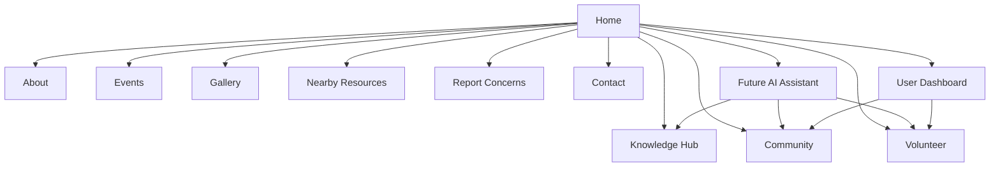

# GauRakshak Bharat
## Product Requirements Document (PRD)

---

# Document Information

| Property | Value |
|----------|-------|
| Product Name | GauRakshak Bharat |
| Document Type | Product Requirements Document |
| Version | 1.0 |
| Status | Planning Phase |
| Product Owner | Hitesh |
| Product Architect | ChatGPT |
| Intended Audience | Developers, Designers, AI Agents, Contributors |
| Last Updated | July 2026 |

---

# Table of Contents

Chapter 1 - Executive Summary

Chapter 2 - Product Overview

Chapter 3 - Problem Statement

Chapter 4 - Product Vision

Chapter 5 - Mission Statement

Chapter 6 - Product Goals

Chapter 7 - Target Users

Chapter 8 - User Personas

Chapter 9 - User Journey

Chapter 10 - Features

Chapter 11 - Functional Requirements

Chapter 12 - Non Functional Requirements

Chapter 13 - Page Specifications

Chapter 14 - Future Roadmap

Chapter 15 - Success Metrics

---

# CHAPTER 1

# Executive Summary

## 1.1 Introduction

GauRakshak Bharat is envisioned as India's most comprehensive digital platform dedicated to promoting awareness, education, volunteer coordination, and responsible community engagement related to cow welfare. The platform is intended to serve as a bridge between individuals, organizations, gaushalas, veterinarians, researchers, students, farmers, and volunteers who wish to contribute positively to animal welfare and sustainable rural development.

Unlike a traditional informational website, GauRakshak Bharat is designed as a long-term digital ecosystem that combines educational resources, community collaboration, volunteer management, knowledge sharing, and modern technology into a single unified platform.

The product is being designed with scalability in mind. While the initial release focuses on a premium, responsive web experience built using HTML, CSS, and JavaScript, the long-term roadmap includes backend services, AI-assisted learning, authentication, real-time communication, mapping services, analytics, and mobile applications.

The guiding principle of the platform is to encourage compassion, responsible action, environmental stewardship, and factual education. Community features are intended to support verified collaboration and lawful reporting workflows while maintaining a respectful and inclusive environment.

---

## 1.2 Purpose of the Product

The primary purpose of GauRakshak Bharat is to create a trusted digital platform where people can learn, collaborate, volunteer, and support cow welfare initiatives.

The platform addresses several needs:

- Providing structured educational content about cows, agriculture, sustainability, and traditional knowledge.
- Helping volunteers discover opportunities to participate in awareness campaigns, events, and community initiatives.
- Connecting users with verified organizations such as gaushalas, NGOs, and veterinary services.
- Offering a centralized location for resources instead of fragmented information across multiple websites and social media channels.
- Encouraging responsible reporting of animal welfare concerns through documented, lawful processes.
- Building a strong digital community centered around service, knowledge, and compassion.

Rather than focusing on a single feature, GauRakshak Bharat is intended to become a comprehensive ecosystem that grows over time while maintaining a consistent design language and user experience.

---

## 1.3 Vision Statement

Our vision is to build India's most trusted digital platform for cow welfare, education, volunteer collaboration, and sustainable community engagement.

We envision a platform where technology strengthens collaboration between citizens, volunteers, organizations, and experts while making reliable information accessible to everyone.

The platform should become the first destination for users seeking to:

- Learn about cow welfare and sustainable agriculture.
- Discover nearby organizations and resources.
- Join volunteer initiatives.
- Participate in educational events.
- Access verified knowledge.
- Contribute to meaningful community projects.

The long-term vision is not simply to build a website but to establish a digital ecosystem capable of supporting millions of users through modern technology, thoughtful design, and scalable architecture.

---

## 1.4 Product Philosophy

Every successful digital platform is built upon a clear philosophy.

GauRakshak Bharat is guided by the following principles:

### Compassion First

The platform promotes empathy toward animals, people, and the environment.

Technology should encourage service rather than conflict.

### Education Before Action

Knowledge creates responsible communities.

Educational resources should always be prioritized before encouraging participation.

### Community Collaboration

Positive social impact requires collaboration between volunteers, organizations, farmers, researchers, and the general public.

The platform should make cooperation simple and rewarding.

### Trust Through Transparency

Users should understand how information is sourced, how reports are handled, and how community features operate.

Verification, moderation, and transparency are essential for building long-term trust.

### Modern Technology for Social Good

Technology should simplify volunteering, learning, and communication while remaining accessible to users with different levels of technical experience.

The user experience should feel modern without becoming unnecessarily complex.

---

## 1.5 Product Positioning

GauRakshak Bharat is positioned as a premium community platform rather than a traditional informational website.

The platform combines several categories into one experience:

- Educational portal
- Volunteer management platform
- Community network
- Resource directory
- Event platform
- Knowledge hub
- Future AI learning assistant

This combination differentiates the platform from websites that only publish articles or maintain organizational information.

The goal is to provide a unified experience where users can learn, participate, connect, and contribute within a single digital ecosystem.

---

## 1.6 Core Objectives

The platform will pursue the following strategic objectives during its initial phases:

### Objective 1

Create a visually outstanding website that demonstrates modern UI/UX principles and serves as a flagship portfolio project.

### Objective 2

Build an educational platform containing structured, searchable, and reliable information related to cow welfare, agriculture, sustainability, and associated topics.

### Objective 3

Develop a scalable community platform capable of supporting volunteers, organizations, and future collaboration features.

### Objective 4

Lay the architectural foundation for future enhancements including authentication, AI assistants, mapping services, notifications, and mobile applications without requiring a complete redesign.

### Objective 5

Promote responsible civic participation by encouraging lawful reporting processes, verified information, and respectful community interaction.

---

## End of Chapter 1 – Part 1

The next part will continue with:

- Strategic Opportunity Analysis
- Market Context
- Stakeholder Identification
- Product Scope
- Business Objectives
- Success Definition
- Product Constraints
- Assumptions
- Risks
- Guiding Principles

---

# CHAPTER 1 – PART 2

# Strategic Opportunity Analysis

---

## 1.7 Why This Platform Should Exist

### Background

India has a rich agricultural history where cattle have played an important role in farming, transportation, dairy production, and rural livelihoods. Today, information related to cow welfare, sustainable farming practices, volunteer initiatives, research, and local organizations is often scattered across many different websites, social media pages, messaging groups, and individual organizations.

As a result, people who genuinely wish to learn, volunteer, or contribute often face challenges finding reliable information or connecting with the appropriate organizations.

GauRakshak Bharat aims to solve this fragmentation by creating a single digital platform that brings together educational resources, verified organizations, volunteer opportunities, community discussions, and future digital services.

The platform is designed to encourage collaboration, awareness, and responsible participation through modern technology.

---

# 1.8 Current Problems

The following problems have been identified during the planning phase.

---

## Problem 1

### Information is Fragmented

People searching for information often need to visit multiple websites, YouTube channels, PDFs, books, WhatsApp groups, and social media pages.

This creates several challenges:

• Information is difficult to verify.

• Content quality varies significantly.

• Beginners do not know where to start.

• Valuable resources become difficult to discover.

---

## Problem 2

### Volunteers Cannot Easily Connect

Many volunteers work independently.

They often have no centralized platform where they can:

- Find nearby volunteers.
- Join awareness campaigns.
- Discover local organizations.
- Learn from experienced members.
- Participate in events.

---

## Problem 3

### Educational Resources Are Not Organized

Educational content exists in many different formats.

Examples include:

Books

Research Papers

Articles

Videos

Interviews

Government Publications

Agricultural Research

Scientific Studies

Traditional Knowledge

Unfortunately, these resources are scattered and difficult to search.

---

## Problem 4

### Organizations Have Limited Digital Presence

Many gaushalas and local organizations have little or no digital visibility.

Potential volunteers may not know:

- Where the organization is located.
- What services it provides.
- Whether volunteers are needed.
- How donations are used.
- How to make contact.

---

## Problem 5

### Lack of Community Collaboration

People with similar interests rarely have a dedicated platform to:

Share experiences.

Discuss ideas.

Ask questions.

Organize awareness events.

Collaborate on projects.

---

## Problem 6

### Modern User Experience Is Missing

Many existing websites have:

Old interfaces

Poor mobile support

Slow performance

Limited accessibility

No animations

Confusing navigation

No community features

Today's users expect a modern digital experience comparable to professional platforms.

---

# 1.9 Product Opportunity

These challenges create an opportunity to build a modern platform that combines education, community, and technology.

Instead of solving one problem, GauRakshak Bharat solves multiple related problems within a single ecosystem.

The opportunity can be summarized as follows:

Education

↓

Community

↓

Volunteer Network

↓

Knowledge Hub

↓

Future AI

↓

Long-term Digital Ecosystem

---

# 1.10 Long-Term Product Vision

The long-term vision extends far beyond the first website release.

Future versions may include:

Verified Volunteer Profiles

Organization Dashboards

Educational Certification

AI Knowledge Assistant

Interactive Maps

Nearby Resources

Digital Volunteer ID

Event Registration

Achievement System

Analytics Dashboard

Mobile Application

Progressive Web App

Offline Learning Resources

Community Recognition System

Multilingual Support

---

# 1.11 Business Objectives

Although GauRakshak Bharat is initially developed as a portfolio and community project, the architecture should support future expansion.

Primary business objectives include:

Building a trusted digital brand.

Growing a nationwide community.

Supporting partner organizations.

Encouraging volunteer participation.

Providing educational value.

Maintaining long-term scalability.

---

# 1.12 Stakeholders

The platform serves multiple stakeholder groups.

---

## Primary Stakeholders

Project Owner

Responsible for overall vision, roadmap, and strategic direction.

---

Community Members

Use educational resources.

Join discussions.

Participate in events.

Support initiatives.

---

Volunteers

Register.

Participate in activities.

Join awareness campaigns.

Receive recognition.

---

Organizations

Create profiles.

Publish events.

Share updates.

Connect with volunteers.

---

Gaushalas

Publish information.

Accept volunteers.

Share requirements.

Display facilities.

---

Veterinary Professionals

Share educational content.

Support awareness.

Participate in future expert discussions.

---

Researchers

Publish articles.

Share scientific findings.

Contribute educational material.

---

Students

Learn.

Research.

Volunteer.

Develop projects.

---

Future Administrators

Moderate content.

Verify organizations.

Review submissions.

Manage users.

Publish announcements.

---

# 1.13 Product Success Definition

The project will be considered successful when:

Users immediately understand the purpose of the platform.

The website feels modern and professional.

Navigation is intuitive.

Animations enhance rather than distract.

Educational resources are easy to discover.

Community participation increases over time.

The architecture supports future expansion without major redesign.

The project demonstrates professional software engineering practices suitable for a portfolio.

---

# 1.14 Guiding Principles

Every future decision should follow these principles.

If a feature does not support these principles, it should be reconsidered.

Principle 1

User Experience First

Every interaction should feel simple, elegant, and responsive.

---

Principle 2

Education Before Complexity

Information should always remain understandable.

Complex topics should be explained progressively.

---

Principle 3

Scalable Architecture

Every component should be reusable.

Every feature should support future expansion.

---

Principle 4

Accessibility Matters

The platform should be usable across devices and by users with varying accessibility needs.

---

Principle 5

Performance Is a Feature

Fast loading.

Optimized assets.

Responsive interactions.

Minimal unnecessary JavaScript.

---

## End of Chapter 1 – Part 2

The next section will cover:

• Product Scope

• In Scope vs Out of Scope

• Product Constraints

• Technical Assumptions

• Risks

• Dependencies

• Product Lifecycle

• Success Metrics

• Release Strategy

• Version Planning

---

# CHAPTER 1 – PART 3

# Product Scope, Constraints & Strategic Planning

---

# 1.15 Product Scope

## Overview

The scope of GauRakshak Bharat defines the boundaries of the product, identifies what will be delivered in each development phase, and prevents uncontrolled feature expansion (scope creep).

The objective is to build a scalable digital platform that delivers value from the first release while maintaining a clear roadmap for future expansion.

Rather than attempting to launch every possible feature at once, the project will evolve through carefully planned development phases.

Every phase should build upon the previous one without requiring major redesigns.

---

# 1.16 Product Scope Statement

GauRakshak Bharat will provide a modern web platform that enables users to:

• Learn about cow welfare.

• Discover educational resources.

• Connect with volunteer communities.

• Participate in awareness initiatives.

• Discover nearby organizations.

• Access trusted information.

• Explore future digital services through a scalable platform.

The platform should serve as a central ecosystem rather than a collection of independent webpages.

---

# 1.17 Phase-wise Scope

---

## Phase 1

### Premium Frontend Website

Objective:

Build a visually outstanding responsive website.

Technology:

HTML

CSS

JavaScript

Deliverables:

✓ Home Page

✓ About

✓ Knowledge Hub

✓ Community

✓ Volunteer

✓ Gallery

✓ Events

✓ Contact

✓ Responsive Design

✓ Dark Mode

✓ Modern Animations

✓ SEO Foundation

✓ Accessibility Foundation

Status:

Highest Priority

---

## Phase 2

### Interactive Platform

Technology

Python Flask

SQLite

Deliverables

User Registration

Login

Profile

Volunteer Dashboard

Organization Dashboard

Admin Panel

Report Storage

Image Upload

Search

Filtering

Future APIs

---

## Phase 3

### Community Platform

Deliverables

Posts

Comments

Groups

Volunteer Profiles

Events

Bookmarks

Notifications

Recognition System

Leaderboard

Digital Certificates

---

## Phase 4

### Smart Platform

Deliverables

AI Knowledge Assistant

AI Search

Voice Search

Image Assistance

Multilingual Translation

Recommendation System

Knowledge Graph

Future RAG Integration

---

## Phase 5

### Advanced Ecosystem

Deliverables

Maps

Nearby Resources

Live Events

Volunteer Tracking

Analytics

Progress Dashboard

PWA

Android App

iOS App

---

# 1.18 In Scope

The following features are included within the current long-term product vision.

---

Education

Knowledge Articles

Research

Traditional Knowledge

Scientific Information

FAQs

Videos

Books

---

Community

Profiles

Groups

Events

Posts

Comments

Volunteer Directory

Recognition

---

Volunteer

Registration

Training

Achievements

Certificates

Digital Identity

---

Resources

Gaushalas

Veterinary Hospitals

NGOs

Research Centers

---

Events

Seminars

Workshops

Awareness Drives

Tree Plantation

Volunteer Campaigns

---

Future AI

Knowledge Assistant

Smart Search

Translation

Recommendations

---

# 1.19 Out of Scope

To maintain focus, the following features are NOT included in Version 1.

Cryptocurrency

NFTs

Gaming

Advertising Platform

Marketplace

E-Commerce

Political Campaigning

Religious Debate Forums

Anonymous Posting

Unverified Emergency Broadcasting

Direct Financial Services

These features may be reconsidered in future versions only if they align with the platform's mission.

---

# 1.20 Product Constraints

Every project operates within constraints.

Understanding them early improves planning.

---

## Technical Constraints

Initially developed using

HTML

CSS

JavaScript

Backend added later.

No unnecessary frameworks in Version 1.

Maintain clean architecture.

---

## Resource Constraints

Initially developed by a single developer.

AI-assisted development.

Limited budget.

Limited hosting resources.

Future contributors expected.

---

## Time Constraints

Project developed incrementally.

Each phase independently deployable.

Continuous improvements preferred over large rewrites.

---

## Financial Constraints

Prefer free tools.

Open-source software.

Free hosting during development.

Cost-effective APIs.

Premium services only if justified.

---

# 1.21 Technical Assumptions

The following assumptions are made during planning.

Users primarily access through modern browsers.

Responsive design is mandatory.

Internet connection available for most features.

Future backend will use REST APIs.

Authentication will be introduced after frontend completion.

Cloud deployment planned after MVP.

Future mobile applications will consume the same backend services.

---

# 1.22 Risks

Several risks may affect project success.

---

Risk

Changing requirements.

Mitigation

Maintain updated PRD.

---

Risk

Scope Creep.

Mitigation

Strict phase planning.

---

Risk

Inconsistent UI.

Mitigation

Central Design System.

---

Risk

Poor Code Quality.

Mitigation

Coding Standards.

Component Library.

Code Reviews.

---

Risk

Performance Issues.

Mitigation

Optimization from the beginning.

Lazy Loading.

Reusable Components.

---

Risk

Knowledge Loss.

Mitigation

Complete documentation.

AI Project Brain.

Git Version Control.

---

# 1.23 Dependencies

Project success depends on

Modern Browser Support

Google Fonts

Future Backend APIs

Maps Integration

Cloudinary

Future Authentication

Future AI APIs

Hosting Platform

GitHub Repository

---

# 1.24 Product Lifecycle

The expected lifecycle is

Research

↓

Planning

↓

Design

↓

Frontend Development

↓

Backend Development

↓

Testing

↓

Deployment

↓

User Feedback

↓

Iteration

↓

Version Updates

↓

Mobile Expansion

↓

Long-term Maintenance

---

# 1.25 MVP Definition

The Minimum Viable Product should include

Beautiful Homepage

Knowledge Hub

About

Volunteer Page

Events

Gallery

Contact

Responsive Layout

Dark Mode

Modern Animations

Professional UI

SEO Foundation

Accessibility

Without these, the platform should not be considered Version 1 complete.

---

# 1.26 Release Strategy

Version 1.0

Premium Frontend

Version 1.5

Backend

Version 2.0

Community

Version 2.5

AI

Version 3.0

Mobile Application

Version 4.0

Nationwide Digital Ecosystem

---

## End of Chapter 1 – Part 3

Next Part Includes

Business Goals

Success Metrics

KPIs

Measurement Strategy

Product Principles

Brand Promise

Value Proposition

Competitive Positioning

Vision 2035

Product Evolution Strategy

Final Executive Summary

---

# CHAPTER 1 – PART 4

# Product Strategy, Business Goals & Success Metrics

---

# 1.27 Product Strategy

## Strategic Vision

GauRakshak Bharat is not intended to be a traditional informational website.

It is designed to become a long-term digital ecosystem that brings together education, technology, volunteer collaboration, community engagement, and organizational support within one unified platform.

Every feature developed for the platform must strengthen one or more of these pillars rather than existing as an isolated capability.

The platform strategy follows four core pillars:

```
                GauRakshak Bharat

                      │

        ┌─────────────┼─────────────┐

        │             │             │

   Education     Community     Technology

                      │

                 Volunteer Network

                      │

               Long-Term Ecosystem
```

The product should evolve gradually while maintaining a consistent user experience and technical architecture.

---

# 1.28 Product Positioning Statement

GauRakshak Bharat is positioned as a modern community platform that combines education, collaboration, and technology for individuals and organizations interested in cow welfare and sustainable community initiatives.

Unlike traditional websites that focus only on articles or organizational information, GauRakshak Bharat provides an integrated experience where users can:

• Learn

• Connect

• Participate

• Volunteer

• Discover nearby resources

• Attend events

• Build community

• Access future AI-powered services

---

# 1.29 Unique Value Proposition

The primary value proposition is:

> "One trusted digital platform where education, volunteers, organizations and technology come together to support cow welfare and community engagement."

The platform delivers value by reducing fragmentation and making reliable resources easier to discover.

---

# 1.30 Business Goals

Although this project begins as a portfolio and community initiative, it should be designed with long-term sustainability in mind.

The primary business goals are:

### Goal 1

Establish GauRakshak Bharat as a trusted digital brand.

---

### Goal 2

Create a highly engaging user experience that encourages visitors to return.

---

### Goal 3

Increase awareness through educational content.

---

### Goal 4

Support collaboration between volunteers and organizations.

---

### Goal 5

Develop an architecture capable of supporting millions of users in the future.

---

### Goal 6

Provide a foundation for future partnerships with NGOs, gaushalas, educational institutions, and researchers.

---

# 1.31 Product Objectives

The objectives are divided into short-term, medium-term and long-term milestones.

---

## Short-Term Objectives

Deliver a visually outstanding frontend.

Create a professional portfolio-quality project.

Establish the design system.

Build reusable architecture.

Ensure mobile responsiveness.

Implement accessibility best practices.

---

## Medium-Term Objectives

User accounts.

Volunteer management.

Knowledge management.

Admin dashboard.

Maps.

Notifications.

---

## Long-Term Objectives

AI Assistant.

Community Platform.

Progressive Web App.

Native Mobile Application.

Analytics Dashboard.

Digital Volunteer Identity.

Advanced Search.

Recommendation Engine.

---

# 1.32 Success Metrics

The project must define measurable indicators of success.

Success is not determined only by completing development.

Instead, measurable outcomes should be monitored.

---

## User Experience Metrics

Average page load time.

Navigation success.

Mobile responsiveness.

Accessibility score.

Performance score.

SEO score.

Animation smoothness.

---

## Community Metrics

Registered users.

Volunteer registrations.

Events created.

Knowledge articles published.

Organizations registered.

Profile completion rate.

---

## Engagement Metrics

Daily Active Users.

Monthly Active Users.

Average Session Duration.

Pages Per Session.

Bounce Rate.

Returning Visitors.

Bookmarks Created.

Search Usage.

---

## Content Metrics

Articles published.

Videos published.

Resources added.

Downloads.

Knowledge Hub visits.

FAQ usage.

---

## Future AI Metrics

AI conversations.

Knowledge search success.

Voice searches.

User satisfaction.

Average response quality.

---

# 1.33 Key Performance Indicators (KPIs)

The following KPIs will be used to evaluate long-term growth.

| Category | KPI |
|----------|-----|
| Community | Active Members |
| Volunteers | Registered Volunteers |
| Organizations | Verified Organizations |
| Education | Articles Published |
| Engagement | Returning Visitors |
| Events | Event Registrations |
| Performance | Lighthouse Score |
| Accessibility | WCAG Compliance |
| SEO | Organic Traffic |
| Platform | User Satisfaction |

---

# 1.34 Product Success Definition

The project will be considered successful when:

✓ Users understand the platform within the first minute.

✓ Navigation feels intuitive.

✓ Mobile experience equals desktop quality.

✓ Every page follows the design system.

✓ Animations enhance usability.

✓ Content remains trustworthy and organized.

✓ The platform architecture supports future expansion.

✓ New developers can understand the project using documentation alone.

---

# 1.35 Brand Promise

Every interaction with GauRakshak Bharat should reinforce the following promise:

"We use technology to educate, connect communities, encourage responsible participation, and support long-term animal welfare through knowledge and collaboration."

This promise should remain consistent across:

Website

Social Media

Mobile Applications

Emails

Documentation

Future APIs

---

# 1.36 Product Principles

Every future feature should satisfy these principles.

---

### Principle 1

Solve a real user problem.

---

### Principle 2

Prefer simplicity over unnecessary complexity.

---

### Principle 3

Design for scalability.

---

### Principle 4

Maintain accessibility.

---

### Principle 5

Keep performance a priority.

---

### Principle 6

Maintain design consistency.

---

### Principle 7

Respect user privacy.

---

### Principle 8

Support responsible and lawful community participation.

---

# 1.37 Product Evolution Strategy

```
Version 1.0

↓

Premium Frontend

↓

Version 1.5

Backend Integration

↓

Version 2.0

Community Platform

↓

Version 2.5

Knowledge Hub Expansion

↓

Version 3.0

AI Assistant

↓

Version 3.5

Maps & Volunteer Ecosystem

↓

Version 4.0

National Digital Platform

↓

Future

Mobile Apps
Analytics
AI Ecosystem
```

---

# 1.38 Strategic Roadmap

```
Research
      │
Planning
      │
Documentation
      │
Design System
      │
Frontend
      │
Backend
      │
Community
      │
AI
      │
Mobile
      │
Continuous Improvement
```

---

## End of Chapter 1 – Part 4

Next Part Includes:

• Vision 2035

• Future Expansion

• Long-Term Product Roadmap

• Product Governance

• Stakeholder Responsibilities

• Product Lifecycle Management

• Release Governance

• Executive Closing Statement

• Chapter Summary

• Final Review Checklist

---

---

# CHAPTER 1 – PART 5

# Long-Term Vision, Governance & Product Evolution

---

# 1.39 Vision 2035

## Long-Term Vision

GauRakshak Bharat is envisioned as India's most trusted digital ecosystem dedicated to education, collaboration, technology, and community engagement related to cow welfare and sustainable rural development.

The objective extends beyond creating a website. The long-term ambition is to establish a technology platform that connects citizens, volunteers, educational institutions, NGOs, gaushalas, veterinary professionals, researchers, and future government or partner organizations through one unified digital ecosystem.

By 2035 the platform should become a reference point for verified educational resources, structured volunteer programs, modern community collaboration, and responsible digital participation.

Technology should simplify participation while preserving trust, transparency, accessibility, and long-term maintainability.

---

# 1.40 Product Evolution Philosophy

Every successful software product evolves gradually.

GauRakshak Bharat will never attempt to become a feature-heavy application overnight.

Instead, development will follow this philosophy:

```
Simple
↓

Useful

↓

Reliable

↓

Trusted

↓

Scalable

↓

Intelligent

↓

Ecosystem
```

Every release should improve the platform while maintaining stability and design consistency.

Features should only be introduced after the previous foundation has matured.

---

# 1.41 Product Lifecycle Strategy

The platform will evolve through continuous iterations rather than complete redesigns.

```
Research

↓

Planning

↓

Documentation

↓

Design

↓

Development

↓

Testing

↓

Deployment

↓

Feedback

↓

Iteration

↓

Improvement

↓

Next Release
```

Each release must leave the architecture stronger than before.

---

# 1.42 Product Governance

## Purpose

Product Governance defines how decisions are made throughout the lifetime of the platform.

Every future contributor should understand:

• who approves features

• how features are evaluated

• when changes are accepted

• how quality is maintained

Governance prevents inconsistent development.

---

## Governance Principles

### Principle 1

Documentation before Development.

No major feature should be implemented without corresponding documentation.

---

### Principle 2

Design before Code.

User experience should be designed before implementation begins.

---

### Principle 3

Reusable Components.

Duplicate implementations should be avoided.

---

### Principle 4

Backward Compatibility.

New features should not unnecessarily break existing functionality.

---

### Principle 5

Continuous Improvement.

Every release should improve quality rather than merely increasing feature count.

---

# 1.43 Stakeholder Responsibilities

## Product Owner

Responsibilities

• Product Vision

• Roadmap

• Prioritization

• Final Decisions

---

## Software Architect

Responsibilities

• Technical Direction

• Architecture

• Code Standards

• Scalability

---

## UI / UX Designer

Responsibilities

• Design System

• Accessibility

• User Experience

• Component Design

---

## Frontend Developer

Responsibilities

• HTML

• CSS

• JavaScript

• Animations

• Responsive Layout

---

## Backend Developer (Future)

Responsibilities

Authentication

Database

API Development

Security

Performance

---

## AI Development

Responsibilities

Knowledge Assistant

Search

Recommendations

Automation

Future AI Features

---

## Community Moderator (Future)

Responsibilities

Content Review

Organization Verification

Volunteer Verification

Community Guidelines

Abuse Prevention

---

# 1.44 Product Decision Framework

Every new feature should answer the following questions.

Does it solve a real user problem?

Does it improve user experience?

Does it fit the product vision?

Does it follow the Design System?

Can it scale?

Can it be maintained?

Will users understand it?

If the answer is "No" to multiple questions, reconsider the feature.

---

# 1.45 Feature Prioritization Model

Features will be classified using four priorities.

## P0

Critical

Examples

Navigation

Responsive Layout

Accessibility

Performance

Core Pages

---

## P1

High Priority

Volunteer System

Knowledge Hub

Events

Gallery

Dark Mode

---

## P2

Medium Priority

Maps

Bookmarks

Achievements

Search Filters

Advanced Animations

---

## P3

Future

AI Assistant

Mobile App

Recommendation Engine

Voice Search

Analytics

---

# 1.46 Product Quality Standards

Every feature must satisfy the following standards.

✓ Responsive

✓ Accessible

✓ Reusable

✓ Modular

✓ SEO Friendly

✓ Secure

✓ Fast

✓ Tested

✓ Documented

✓ Maintainable

Quality is never optional.

---

# 1.47 Release Governance

Every release follows the same workflow.

```
Idea

↓

Requirement

↓

Documentation

↓

Design

↓

Prototype

↓

Development

↓

Testing

↓

Review

↓

Approval

↓

Deployment

↓

Feedback

↓

Improvement
```

This workflow ensures consistency throughout the product lifecycle.

---

# 1.48 Future Expansion Strategy

Future modules may include:

• Mobile Application

• Progressive Web App

• AI Knowledge Assistant

• Live Chat

• Volunteer Dashboard

• Organization Dashboard

• Donation Management

• Research Portal

• Digital Learning Platform

• Certification System

• Analytics Dashboard

• GIS / Maps

• Notification System

These modules should integrate with the existing architecture rather than replacing it.

---

# 1.49 Executive Closing Statement

GauRakshak Bharat is intended to become more than a modern website.

It is a long-term digital initiative focused on education, responsible community collaboration, volunteer engagement, and technology-driven awareness.

Every design decision, software component, and future enhancement should reinforce the platform's core principles:

• Compassion

• Education

• Transparency

• Accessibility

• Sustainability

• Community

• Scalability

The success of the platform will not be measured only by its visual appearance but by its ability to provide lasting value to users while remaining maintainable, extensible, and trustworthy.

---

# Chapter 1 Completion Checklist

## Vision

✓ Completed

## Mission

✓ Completed

## Product Philosophy

✓ Completed

## Opportunity Analysis

✓ Completed

## Product Strategy

✓ Completed

## Business Goals

✓ Completed

## Product Scope

✓ Completed

## Constraints

✓ Completed

## Governance

✓ Completed

## Long-Term Vision

✓ Completed

## Success Metrics

✓ Completed

## Release Strategy

✓ Completed

---

# End of Chapter 1

Status: COMPLETE

Version: Draft 1.0

---

# CHAPTER 2

# Product Overview & Product Definition

---

# Chapter Information

| Property | Value |
|----------|-------|
| Chapter | 2 |
| Name | Product Overview & Product Definition |
| Version | 1.0 |
| Status | Draft |
| Related Chapters | Chapter 1, Chapter 3, Chapter 4 |

---

# 2.1 Introduction

This chapter defines the overall structure of GauRakshak Bharat as a digital platform.

While Chapter 1 established the vision, philosophy, and strategic direction, this chapter explains what the platform actually is, who it serves, how its modules interact, and how it will evolve over time.

Every future development activity should align with the product definition described in this chapter.

---

# 2.2 Product Definition

GauRakshak Bharat is a modern web platform designed to promote education, community collaboration, volunteer engagement, and responsible support for cow welfare initiatives.

The platform combines several independent systems into one integrated ecosystem.

Instead of functioning as a simple informational website, GauRakshak Bharat acts as a digital hub where users can:

• Learn

• Connect

• Volunteer

• Participate

• Discover

• Share

• Grow

The architecture should allow every module to function independently while remaining fully integrated with the rest of the platform.

---

# 2.3 Product Category

The platform belongs to multiple categories simultaneously.

| Category | Description |
|-----------|-------------|
| Educational Platform | Articles, learning resources, research and awareness |
| Community Platform | User interaction and collaboration |
| Volunteer Platform | Volunteer registration and engagement |
| Resource Directory | Verified organizations and nearby resources |
| Event Platform | Awareness campaigns and community events |
| Knowledge Hub | Structured educational content |
| Future AI Platform | Intelligent search and learning assistance |

This multi-category approach differentiates GauRakshak Bharat from conventional informational websites.

---

# 2.4 Product Ecosystem

The product is built around interconnected modules.

```
                    GauRakshak Bharat

                           │

        ┌──────────────────┼──────────────────┐

        │                  │                  │

   Education         Community         Volunteer

        │                  │                  │

Knowledge Hub       Organizations      Events

        │                  │                  │

 Research          Nearby Resources    AI Assistant

                           │

                     Future Mobile App
```

Every module should communicate through shared navigation, a consistent design system, and reusable components.

---

# 2.5 Platform Objectives

The platform has six primary objectives.

---

## Objective 1

Provide trustworthy educational resources.

Requirement ID

OBJ-001

---

## Objective 2

Build a connected volunteer community.

Requirement ID

OBJ-002

---

## Objective 3

Support verified organizations.

Requirement ID

OBJ-003

---

## Objective 4

Promote responsible participation.

Requirement ID

OBJ-004

---

## Objective 5

Deliver an outstanding user experience.

Requirement ID

OBJ-005

---

## Objective 6

Provide a scalable technical foundation.

Requirement ID

OBJ-006

---

# 2.6 Product Characteristics

The platform should be:

Modern

Responsive

Fast

Scalable

Accessible

Educational

Professional

Secure

Community-focused

Technology-driven

Every future feature must reinforce these characteristics.

---

# 2.7 Product Principles

The following principles govern all future development.

### PP-001

Education before complexity.

---

### PP-002

Users should never feel overwhelmed.

---

### PP-003

Technology should simplify participation.

---

### PP-004

Every interaction should feel intuitive.

---

### PP-005

Accessibility is mandatory.

---

### PP-006

Responsive design is non-negotiable.

---

### PP-007

Reusable architecture over duplicated implementation.

---

### PP-008

Consistency is more important than visual novelty.

---

# 2.8 Core Platform Modules

The platform consists of the following primary modules.

| Module ID | Module Name |
|------------|-------------|
| MOD-001 | Home |
| MOD-002 | About |
| MOD-003 | Knowledge Hub |
| MOD-004 | Community |
| MOD-005 | Volunteer |
| MOD-006 | Events |
| MOD-007 | Gallery |
| MOD-008 | Nearby Resources |
| MOD-009 | Contact |
| MOD-010 | Report Concerns |
| MOD-011 | AI Assistant (Future) |
| MOD-012 | Dashboard (Future) |

Each module will receive a dedicated specification in later chapters.

---

# 2.9 Product Development Philosophy

Every release should satisfy three conditions:

1. Improve user experience.

2. Improve maintainability.

3. Prepare for future expansion.

New functionality should never compromise performance, accessibility, or design consistency.

---

# 2.10 Product Lifecycle

The expected lifecycle is illustrated below.

```
Research

↓

Planning

↓

Documentation

↓

Design

↓

Frontend Development

↓

Backend Development

↓

Testing

↓

Deployment

↓

User Feedback

↓

Iteration

↓

Version Upgrade
```

The lifecycle is continuous rather than linear.

Every completed version becomes the foundation for the next release.

---

# 2.11 MVP Definition

The Minimum Viable Product (MVP) represents the smallest version of GauRakshak Bharat that delivers meaningful value.

Version 1.0 should include:

✓ Premium Homepage

✓ About Page

✓ Knowledge Hub

✓ Volunteer Page

✓ Community Overview

✓ Events

✓ Gallery

✓ Contact

✓ Responsive Design

✓ Dark Mode

✓ Modern Animations

✓ Accessibility

✓ SEO Foundation

Future features such as authentication, AI, maps, dashboards, and notifications are intentionally excluded from the MVP to keep the first release focused and maintainable.

---

## End of Chapter 2 – Part 1

The next part will cover:

- Product Modules in Detail
- Navigation Hierarchy
- Information Architecture
- Feature Relationships
- Module Dependencies
- User Flow Overview
- MVP vs Future Releases Matrix
- Product Capability Map

---
---

# CHAPTER 2 – PART 2

# Product Modules & Information Architecture

---

# 2.12 Platform Architecture Overview

## Introduction

The GauRakshak Bharat platform follows a **modular architecture**, where every major feature is developed as an independent module while remaining fully integrated with the overall platform.

This approach provides several advantages:

- Easier maintenance
- Better scalability
- Reusable UI components
- Faster feature development
- Simpler testing
- Future backend integration
- AI-friendly architecture

Each module has a clearly defined purpose, responsibilities, dependencies, and future expansion roadmap.

---

# 2.13 High-Level Platform Architecture



---

# 2.14 Module Hierarchy

```
GauRakshak Bharat

│

├── Home

├── About

├── Knowledge Hub

│      ├── Articles

│      ├── Videos

│      ├── FAQs

│      ├── Research

│      └── Cow Breeds

│

├── Community

│      ├── Profiles

│      ├── Groups

│      ├── Discussions

│      └── Recognition

│

├── Volunteer

│      ├── Registration

│      ├── Training

│      ├── Certificates

│      └── Dashboard

│

├── Events

├── Gallery

├── Nearby Resources

├── Contact

├── Report Concerns

└── AI Assistant (Future)
```

---

# 2.15 Module Specifications

---

## MOD-001

### Home

Purpose

Introduce the platform.

Create trust.

Encourage exploration.

Guide users toward important sections.

Primary Users

All users.

Dependencies

Navigation

Animations

CTA

Footer

Future AI

Statistics

Priority

P0

---

## MOD-002

### About

Purpose

Explain

Mission

Vision

History

Values

Community Goals

Priority

P0

---

## MOD-003

### Knowledge Hub

Purpose

Become India's most organized digital library for educational resources related to cow welfare, sustainable agriculture, research, and awareness.

Submodules

Articles

Research Papers

Books

Videos

FAQs

Categories

Search

Bookmarks

Future AI Search

Priority

P0

---

## MOD-004

### Community

Purpose

Build meaningful collaboration between users.

Future Features

Profiles

Groups

Recognition

Achievements

Volunteer Ranking

Community Feed

Priority

P1

---

## MOD-005

### Volunteer

Purpose

Help users become verified volunteers.

Future Features

Training

Digital ID

Certificates

Achievements

Volunteer Dashboard

Priority

P1

---

## MOD-006

### Events

Purpose

Publish

Seminars

Campaigns

Awareness Programs

Volunteer Activities

Priority

P1

---

## MOD-007

### Gallery

Purpose

Display

Images

Videos

Success Stories

Community Moments

Priority

P2

---

## MOD-008

### Nearby Resources

Purpose

Help users discover

Gaushalas

Veterinary Hospitals

NGOs

Animal Care Centers

Priority

P2

---

## MOD-009

### Report Concerns

Purpose

Provide users with a structured way to submit concerns related to animal welfare to the appropriate administrators or organizations.

The platform should encourage factual reporting, evidence where appropriate, and lawful escalation rather than encouraging direct confrontation.

Future Workflow

Submit Report

↓

Review

↓

Verification

↓

Forward to Appropriate Authority / Organization

↓

Status Updates

Priority

P2

---

## MOD-010

### Contact

Purpose

Allow users to communicate with the platform administrators.

Features

Contact Form

FAQ

Social Links

Email

Feedback

Priority

P0

---

## MOD-011

### AI Assistant

Future Module

Purpose

Provide intelligent educational assistance.

Capabilities

Smart Search

Question Answering

Knowledge Retrieval

Recommendations

Learning Guidance

Priority

P3

---

## MOD-012

### User Dashboard

Future Module

Purpose

Provide personalized experiences.

Future Features

Volunteer Progress

Saved Articles

Achievements

Certificates

Bookmarks

Notifications

Profile

Priority

P3

---

# 2.16 Module Dependency Matrix

| Module | Depends On |
|---------|------------|
| Home | Navigation, Footer |
| About | Navigation |
| Knowledge Hub | Search, Categories |
| Community | Authentication |
| Volunteer | Authentication |
| Events | Calendar |
| Gallery | Image System |
| Nearby Resources | Maps |
| Contact | Contact Form |
| AI Assistant | Knowledge Hub |
| Dashboard | Authentication |

---

# 2.17 Platform Navigation Hierarchy

```
Navigation

│

├── Home

├── About

├── Knowledge Hub

├── Community

├── Volunteer

├── Events

├── Gallery

├── Nearby Resources

├── Report Concerns

└── Contact
```

Navigation should remain consistent across every page.

The navigation bar must never exceed two interaction levels.

---

# 2.18 Design Principles for Modules

Every module should follow identical design rules.

✓ Same spacing

✓ Same typography

✓ Same animations

✓ Same buttons

✓ Same card system

✓ Same color palette

✓ Same responsive behavior

✓ Same accessibility standards

Consistency is more important than introducing unique styles for each page.

---

## End of Chapter 2 – Part 2

Next Part Includes

• Information Architecture

• User Navigation Flow

• Page Relationships

• Component Relationships

• Internal Linking Strategy

• Search Architecture

• SEO Structure

• Future Backend Relationships

---
---

# CHAPTER 2 – PART 3

# Information Architecture & User Navigation

---

# 2.19 Information Architecture (IA)

## Introduction

Information Architecture (IA) defines how content, pages, modules, and features are organized throughout GauRakshak Bharat.

A well-designed IA ensures that users can locate information quickly, understand relationships between pages, and complete tasks with minimal effort.

The IA for GauRakshak Bharat is based on three principles:

- Discoverability
- Simplicity
- Scalability

The platform should feel intuitive to first-time visitors while remaining efficient for returning users.

---

# 2.20 IA Design Principles

Every page and feature must follow these principles.

### IA-001 — Logical Grouping

Related content should always be grouped together.

Example:

Knowledge Hub contains:

- Articles
- Videos
- Research Papers
- FAQs
- Cow Breeds

Rather than distributing them across unrelated pages.

---

### IA-002 — Maximum Three Click Rule

Users should reach important information within **three interactions** whenever practical.

Examples:

Home → Knowledge Hub → Article

Home → Volunteer → Registration

Home → Nearby Resources → Gaushala

---

### IA-003 — Consistent Navigation

Primary navigation must remain identical across every page.

Users should never wonder where they are.

---

### IA-004 — Progressive Disclosure

Show basic information first.

Reveal advanced information only when users request it.

This keeps interfaces clean and reduces cognitive load.

---

### IA-005 — Mobile First

Navigation must remain equally usable on:

- Desktop
- Laptop
- Tablet
- Mobile

No feature should exist only on desktop.

---

# 2.21 Complete Site Map

```text
GauRakshak Bharat

│

├── Home

│     ├── Hero

│     ├── Mission

│     ├── Statistics

│     ├── Why Cows Matter

│     ├── Community Highlights

│     ├── Events Preview

│     ├── Testimonials

│     └── Footer

│

├── About

│     ├── Vision

│     ├── Mission

│     ├── Core Values

│     ├── History

│     ├── FAQs

│     └── Timeline

│

├── Knowledge Hub

│     ├── Articles

│     ├── Research

│     ├── Videos

│     ├── FAQs

│     ├── Cow Breeds

│     ├── Sustainable Farming

│     └── Search

│

├── Community

│     ├── Volunteer Stories

│     ├── Community Feed (Future)

│     ├── Recognition

│     └── Organizations

│

├── Volunteer

│     ├── Registration

│     ├── Training

│     ├── Benefits

│     └── Certificates

│

├── Events

│     ├── Upcoming

│     ├── Past

│     └── Event Details

│

├── Gallery

│     ├── Photos

│     ├── Videos

│     └── Success Stories

│

├── Nearby Resources

│     ├── Gaushalas

│     ├── Veterinary Services

│     ├── NGOs

│     └── Animal Hospitals

│

├── Report Concerns

│     ├── Guidelines

│     ├── Report Form

│     ├── Evidence Upload

│     └── Status (Future)

│

└── Contact

      ├── Contact Form

      ├── Email

      ├── FAQ

      └── Feedback
```

---

# 2.22 Navigation Hierarchy

The navigation hierarchy is intentionally shallow.

Level 1

```
Home
About
Knowledge Hub
Community
Volunteer
Events
Gallery
Nearby Resources
Report Concerns
Contact
```

Level 2

Individual sections inside each page.

No Level 3 navigation should be exposed in the main navigation menu.

---

# 2.23 User Navigation Flow

## First-Time Visitor

```text
Landing Page

↓

Hero Section

↓

Mission

↓

Why This Platform Exists

↓

Knowledge Hub

↓

Volunteer

↓

Community

↓

Call to Action

↓

Registration (Future)
```

Goal:

Educate → Inspire → Encourage Participation

---

## Returning Visitor

```text
Home

↓

Knowledge Hub

↓

Saved Articles (Future)

↓

Events

↓

Community

↓

Dashboard (Future)
```

Goal:

Efficiency and engagement.

---

## Volunteer Journey

```text
Home

↓

Volunteer Page

↓

Training

↓

Registration

↓

Verification (Future)

↓

Dashboard (Future)

↓

Events

↓

Recognition
```

---

## Research User Journey

```text
Home

↓

Knowledge Hub

↓

Research

↓

Articles

↓

Downloads

↓

References
```

---

# 2.24 Internal Linking Strategy

Every major page should recommend relevant pages.

Example:

Knowledge Hub

↓

Related Articles

↓

Volunteer Opportunities

↓

Upcoming Events

↓

Nearby Organizations

↓

Contact

This creates a connected ecosystem instead of isolated pages.

---

# 2.25 Search Architecture

The search system should eventually support:

- Articles
- Videos
- FAQs
- Research
- Events
- Organizations
- Cow Breeds
- Future AI Answers

Users should never need separate search systems for different modules.

---

# 2.26 Breadcrumb Strategy

Breadcrumbs improve navigation and SEO.

Example:

```
Home

↓

Knowledge Hub

↓

Articles

↓

Organic Farming

↓

Article Title
```

Breadcrumbs should appear on all deep-content pages.

---

# 2.27 Navigation Decision Matrix

| User Goal | Primary Entry Page | Supporting Pages |
|------------|-------------------|------------------|
| Learn | Knowledge Hub | About, FAQs |
| Volunteer | Volunteer | Community, Events |
| Find Resources | Nearby Resources | Contact |
| Read Research | Knowledge Hub | Research |
| Join Event | Events | Volunteer |
| Contact Team | Contact | About |

---

# 2.28 Future Navigation Enhancements

Future versions may include:

- Mega Menu
- Global Search
- AI Search
- Voice Search
- Quick Actions
- Recently Viewed Pages
- Personalized Shortcuts
- User Dashboard Menu
- Organization Dashboard Menu

These enhancements should build upon the same IA rather than replacing it.

---

## End of Chapter 2 – Part 3

Next Part Includes:

- Product Capability Map
- Feature Dependency Matrix
- Module Communication
- Cross-Module Relationships
- User Roles & Permissions Overview
- Future API Boundaries
- System Expansion Model

---
---

# CHAPTER 2 – PART 4

# Product Capability Model & System Relationships

---

# 2.29 Product Capability Model

## Introduction

The Product Capability Model (PCM) describes every major capability that GauRakshak Bharat will provide throughout its lifecycle.

Unlike features, which represent individual functions, capabilities represent complete business functions delivered by one or more modules.

This model allows developers, designers, testers, and AI agents to understand how the platform evolves over time.

Every new feature must belong to an existing capability or justify the creation of a new capability.

---

# 2.30 Capability Hierarchy

```
                    GauRakshak Bharat

                            │

        ┌───────────────────┼────────────────────┐

        │                   │                    │

 Education           Community          Volunteer

        │                   │                    │

 Knowledge Hub      Organizations      Events

        │                   │                    │

 Research         Nearby Resources     Dashboard

                            │

                     AI Assistant

                            │

                    Mobile Application
```

---

# 2.31 Core Product Capabilities

---

## CAP-001

### Education

Purpose

Provide structured and trustworthy educational content.

Includes

Articles

Research Papers

Videos

Frequently Asked Questions

Cow Breeds

Organic Farming

Traditional Knowledge

Scientific Studies

Future AI Learning

Priority

Critical

---

## CAP-002

### Community

Purpose

Enable collaboration between individuals and organizations.

Includes

Volunteer Stories

Community Feed

Recognition

Organization Profiles

Discussion Platform

Future Messaging

Priority

High

---

## CAP-003

### Volunteer Management

Purpose

Provide a complete volunteer journey.

Includes

Registration

Training

Certification

Achievements

Volunteer Dashboard

Digital ID

Priority

High

---

## CAP-004

### Resource Discovery

Purpose

Help users discover verified resources.

Includes

Gaushalas

Veterinary Services

Animal Hospitals

NGOs

Research Centers

Future Maps

Priority

High

---

## CAP-005

### Events

Purpose

Encourage participation through organized events.

Includes

Seminars

Awareness Campaigns

Volunteer Drives

Tree Plantation

Educational Programs

Event Registration

Future Attendance Tracking

Priority

Medium

---

## CAP-006

### AI Knowledge Platform

Purpose

Provide intelligent educational assistance.

Future Features

Question Answering

Semantic Search

Recommendation Engine

Voice Search

Multilingual Support

Priority

Future

---

# 2.32 Capability Dependency Matrix

| Capability | Depends On |
|------------|------------|
| Education | Knowledge Hub |
| Community | Authentication (Future) |
| Volunteer | Authentication + Dashboard |
| Resources | Maps (Future) |
| Events | Community |
| AI | Knowledge Hub |

Dependencies should remain minimal to reduce complexity.

---

# 2.33 Cross Module Communication

Although every module functions independently, they must communicate where appropriate.

Example

Knowledge Hub

↓

Related Event

↓

Volunteer Opportunity

↓

Nearby Organization

↓

Community Discussion

↓

Contact

Every page should naturally encourage exploration.

---

# 2.34 User Role Overview

The platform will eventually support multiple user roles.

```
Visitor

↓

Registered User

↓

Volunteer

↓

Organization

↓

Moderator

↓

Administrator

↓

Super Administrator
```

Each role gains additional permissions without losing previous capabilities.

---

# 2.35 User Capability Matrix

| Capability | Visitor | User | Volunteer | Organization | Admin |
|------------|:------:|:----:|:----------:|:------------:|:-----:|
| Browse Pages | ✓ | ✓ | ✓ | ✓ | ✓ |
| Search Content | ✓ | ✓ | ✓ | ✓ | ✓ |
| Register | ✓ | — | — | — | — |
| Join Events | — | ✓ | ✓ | ✓ | ✓ |
| Volunteer Dashboard | — | — | ✓ | — | ✓ |
| Publish Events | — | — | — | ✓ | ✓ |
| Manage Content | — | — | — | — | ✓ |

---

# 2.36 Permission Strategy

The platform follows the principle of least privilege.

Users receive only the permissions necessary for their role.

Benefits

Improved security

Simpler administration

Reduced accidental misuse

Better scalability

Future API compatibility

---

# 2.37 Product Expansion Model

Every future capability should extend the platform rather than replace existing functionality.

```
Version 1

↓

Education

↓

Community

↓

Volunteer

↓

Events

↓

Authentication

↓

AI

↓

Maps

↓

Analytics

↓

Mobile

↓

National Digital Ecosystem
```

The architecture must remain stable throughout this evolution.

---

# 2.38 Future API Boundaries

Future backend APIs will be organized by capability.

Example

/api/articles

/api/events

/api/volunteers

/api/community

/api/resources

/api/auth

/api/users

/api/ai

Each capability owns its own API domain to keep the backend modular.

---

# 2.39 Data Ownership

Every module should own its data.

Examples

Knowledge Hub

Owns Articles

Research

Categories

Bookmarks

Volunteer Module

Owns Registration

Certificates

Achievements

Dashboard

Community

Owns Groups

Posts

Comments

Recognition

This separation improves maintainability and future scalability.

---

# 2.40 Future Integration Points

Planned integrations include:

Google Maps

Cloudinary

Email Service

Push Notifications

AI Models

Analytics Platform

Authentication Provider

Calendar APIs

Payment Gateway (Future Donations)

Every integration should remain optional and loosely coupled.

---

# 2.41 Engineering Principles

Every new capability must satisfy:

✓ Reusable

✓ Testable

✓ Documented

✓ Accessible

✓ Secure

✓ Responsive

✓ Scalable

✓ AI-Friendly

✓ Modular

No feature should violate these principles.

---

## End of Chapter 2 – Part 4

Next Part Includes

• Competitive Analysis

• SWOT Analysis

• Product Differentiation

• MVP vs Future Matrix

• Release Planning

• Chapter Summary

• Final Review Checklist

• Product Readiness Assessment

---
---

# CHAPTER 2 – PART 5

# Product Positioning, Competitive Analysis & Release Strategy

---

# 2.42 Product Positioning

## Positioning Statement

GauRakshak Bharat is positioned as a **modern, community-driven digital ecosystem** that combines education, volunteer engagement, resource discovery, and future AI-powered assistance into one unified platform.

Unlike conventional informational websites, the platform emphasizes interaction, collaboration, and long-term community building while maintaining a clean, modern, and accessible user experience.

The product should be recognized for:

- Premium user interface
- Educational excellence
- Community engagement
- Trustworthy information
- Scalability
- Future-ready architecture

---

# 2.43 Product Differentiation

The following characteristics distinguish GauRakshak Bharat from traditional informational websites.

| Traditional Website | GauRakshak Bharat |
|---------------------|-------------------|
| Static Pages | Interactive Platform |
| Limited Content | Structured Knowledge Hub |
| Minimal Community | Community Ecosystem |
| No Volunteer System | Complete Volunteer Journey |
| Basic Design | Premium Modern UI |
| Isolated Pages | Connected User Experience |
| No AI | Future AI Knowledge Assistant |

The goal is to create a digital platform rather than a collection of webpages.

---

# 2.44 Competitive Landscape

Rather than directly competing with any single website, GauRakshak Bharat draws inspiration from different categories of successful products.

### UI & User Experience

- Apple
- Stripe
- Linear
- Vercel

**Learning:** Clean layouts, smooth animations, consistent spacing.

---

### Knowledge Platforms

- Wikipedia
- Government educational portals
- Digital libraries

**Learning:** Well-organized content and reliable information architecture.

---

### Community Platforms

- Reddit
- Discord
- LinkedIn Communities

**Learning:** Strong user engagement and structured discussions.

---

### Volunteer & Non-Profit Platforms

- Volunteer management systems
- NGO portals

**Learning:** Easy onboarding, event participation, and recognition systems.

---

# 2.45 SWOT Analysis

## Strengths

- Clear mission
- Modern UI/UX vision
- Modular architecture
- Scalable roadmap
- Strong documentation
- AI-ready foundation

---

## Weaknesses

- Initial development by a small team
- Backend planned for later phases
- Limited initial content
- Gradual feature rollout

---

## Opportunities

- Growing interest in digital volunteering
- Expansion into multilingual education
- AI-assisted learning
- Collaboration with organizations
- Mobile application
- Research partnerships

---

## Threats

- Rapid technology changes
- Misinformation on the internet
- Content maintenance challenges
- Scalability as the community grows
- Security risks if moderation is weak

---

# 2.46 MVP vs Future Release Matrix

| Feature | MVP | Future |
|----------|:---:|:------:|
| Responsive Website | ✓ | ✓ |
| Premium UI | ✓ | ✓ |
| Dark Mode | ✓ | ✓ |
| Knowledge Hub | ✓ | ✓ |
| Events | ✓ | ✓ |
| Gallery | ✓ | ✓ |
| Nearby Resources | ✓ | ✓ |
| Volunteer Registration | ✓ | ✓ |
| User Authentication | — | ✓ |
| Community Feed | — | ✓ |
| Dashboard | — | ✓ |
| AI Assistant | — | ✓ |
| Maps Integration | — | ✓ |
| Notifications | — | ✓ |
| Mobile App | — | ✓ |

The MVP focuses on delivering a polished and useful experience while laying the groundwork for future capabilities.

---

# 2.47 Product Readiness Criteria

Before Version 1.0 is released, the following criteria must be satisfied.

### Functional

- All primary pages completed
- Navigation operational
- Responsive layout verified
- Dark mode functioning
- Links validated

---

### Quality

- Consistent design
- Smooth animations
- Fast loading
- Clean code
- Accessibility review completed

---

### Content

- Educational content reviewed
- Images optimized
- Placeholder content removed
- Metadata completed

---

### Technical

- HTML validated
- CSS organized
- JavaScript modular
- SEO basics implemented
- Performance optimized

---

# 2.48 Release Strategy

The project will follow an incremental release model.

### Version 1.0

Premium Frontend Website

Focus:

- UI/UX
- Education
- Responsiveness
- Foundation

---

### Version 1.5

Backend Integration

Focus:

- Authentication
- Database
- User Profiles
- Content Management

---

### Version 2.0

Community Platform

Focus:

- Groups
- Posts
- Discussions
- Recognition

---

### Version 2.5

Volunteer Ecosystem

Focus:

- Digital ID
- Certificates
- Achievements
- Dashboard

---

### Version 3.0

AI Platform

Focus:

- Knowledge Assistant
- Smart Search
- Recommendations
- Voice Interaction

---

### Version 4.0

National Digital Ecosystem

Focus:

- Mobile Apps
- Maps
- Analytics
- Partner Integrations
- Advanced Community Features

---

# 2.49 Product Risks & Mitigation

| Risk | Mitigation |
|------|------------|
| Scope Creep | Follow phased roadmap |
| Inconsistent Design | Design System |
| Technical Debt | Coding Standards |
| Poor Performance | Optimization Guidelines |
| Documentation Drift | Update documentation with every major feature |
| Security Issues | Security Guidelines and reviews |

---

# 2.50 Chapter Validation Checklist

## Product Overview

✓ Defined

---

## Platform Modules

✓ Defined

---

## Information Architecture

✓ Defined

---

## User Navigation

✓ Defined

---

## Capability Model

✓ Defined

---

## Product Positioning

✓ Defined

---

## Release Strategy

✓ Defined

---

## Risk Assessment

✓ Defined

---

## MVP Definition

✓ Defined

---

## Future Roadmap

✓ Defined

---

# 2.51 Key Takeaways

This chapter establishes GauRakshak Bharat as a long-term digital platform rather than a conventional website.

It defines:

- The overall product structure
- Platform capabilities
- Information architecture
- Module relationships
- Product positioning
- Competitive context
- Release strategy
- Long-term scalability

All future design and engineering work should align with the principles defined in this chapter.

---

# End of Chapter 2

Status: COMPLETE

Version: Draft 1.0
---

# CHAPTER 3

# User Research & Personas

---

# Chapter Information

| Property | Value |
|----------|-------|
| Chapter | 3 |
| Name | User Research & Personas |
| Version | 1.0 |
| Status | Draft |
| Related Chapters | Chapter 1, Chapter 2, Chapter 4 |

---

# 3.1 Introduction

Every successful product is built around its users.

Technology alone does not create a valuable platform. Understanding the people who will use the platform, their motivations, goals, frustrations, and expectations is essential for making good design and engineering decisions.

This chapter defines the target audience of GauRakshak Bharat and establishes representative user personas that will guide future development.

Each persona represents a group of users with similar characteristics, objectives, and behaviors.

These personas should be referenced before designing any new feature.

---

# 3.2 Research Objectives

The objectives of user research are to:

• Identify the primary user groups.

• Understand why users visit the platform.

• Discover user expectations.

• Identify pain points.

• Improve usability.

• Design intuitive navigation.

• Prioritize features.

• Ensure accessibility.

• Build features that provide real value.

---

# 3.3 Primary User Groups

The platform serves multiple categories of users.

| ID | User Group |
|----|------------|
| USR-001 | General Visitor |
| USR-002 | Student |
| USR-003 | Volunteer |
| USR-004 | NGO Representative |
| USR-005 | Gaushala Manager |
| USR-006 | Farmer |
| USR-007 | Veterinary Professional |
| USR-008 | Researcher |
| USR-009 | Administrator (Future) |

Each user group has unique objectives and requires different platform capabilities.

---

# 3.4 Persona Framework

Every persona will include:

• Background

• Goals

• Motivations

• Pain Points

• Technical Skills

• Device Usage

• Accessibility Needs

• Platform Expectations

• User Journey

• Future Features

---

# PERSONA 1

---

# PER-001

## General Visitor

### Overview

The General Visitor represents individuals who arrive at GauRakshak Bharat to learn about the platform, understand its mission, or explore educational resources.

They are usually first-time visitors with little prior knowledge of the platform.

---

### Demographics

Age

18–60

Occupation

Varies

Education

High School to Higher Education

Technical Skill

Basic

Primary Device

Mobile Phone

Secondary Device

Laptop

---

### Goals

• Learn about the platform.

• Understand the mission.

• Explore educational content.

• Discover nearby organizations.

• Decide whether to become involved.

---

### Motivations

Reliable information.

Simple navigation.

Professional appearance.

Easy-to-understand language.

Fast website.

---

### Pain Points

Information scattered across different websites.

Difficult navigation.

Poor mobile experience.

Unclear volunteer opportunities.

Outdated websites.

---

### Accessibility Needs

Readable typography.

Large buttons.

Good color contrast.

Responsive layout.

Simple navigation.

Fast loading.

---

### Success Criteria

The visitor should understand the purpose of GauRakshak Bharat within the first two minutes.

They should easily discover:

• About

• Knowledge Hub

• Volunteer Page

• Events

without confusion.

---

### User Journey

Landing Page

↓

Hero Section

↓

Mission

↓

Knowledge Hub

↓

About

↓

Volunteer

↓

Contact

---

### Feature Priority

Knowledge Hub

★★★★★

Volunteer

★★★★☆

Events

★★★☆☆

Gallery

★★★☆☆

Community

★★★☆☆

---

### UX Notes

The homepage should immediately communicate trust, professionalism, and purpose.

Avoid overwhelming first-time users with excessive information.

Focus on education before engagement.

---

## End of Persona 1

Next Persona

PER-002

Student
---

# CHAPTER 3 – PART 2

# Detailed User Personas

---

# PERSONA 2

---

# PER-002

## Student

### Persona Summary

The Student Persona represents college and university students who visit GauRakshak Bharat for learning, research, volunteering, project development, and community participation.

Students are one of the most important user groups because they are likely to become future volunteers, researchers, contributors, and ambassadors of the platform.

---

## Demographics

| Property | Value |
|-----------|-------|
| Age | 17–28 Years |
| Education | School / College / University |
| Occupation | Student |
| Technical Skills | Intermediate |
| Internet Usage | High |
| Preferred Device | Mobile + Laptop |
| Language | English + Regional Language |

---

## Background

Students frequently search for:

• Project topics

• Research papers

• Educational resources

• Internship opportunities

• Community activities

• Awareness campaigns

• Volunteer certificates

Many students participate in social initiatives through colleges and NGOs.

The platform should make educational resources and volunteer opportunities easily accessible.

---

## Primary Goals

• Learn about cow welfare.

• Access authentic research.

• Complete academic projects.

• Participate in awareness events.

• Join volunteer activities.

• Earn certificates.

• Build a meaningful portfolio.

---

## Motivations

Students are motivated by:

Knowledge

Learning

Recognition

Certificates

Real-world experience

Community participation

Career development

---

## Pain Points

Finding authentic educational material.

Scattered information.

Poorly designed websites.

No central learning platform.

Lack of project resources.

Difficulty finding volunteer opportunities.

---

## Technical Behaviour

Uses Google Search frequently.

Comfortable using modern websites.

Prefers interactive content.

Likes videos.

Uses mobile first.

Uses desktop for research.

---

## Accessibility Needs

Responsive design.

Dark mode.

Search functionality.

Readable typography.

Keyboard navigation.

Fast loading pages.

---

## Typical Tasks

Read Articles

↓

Watch Videos

↓

Download Resources

↓

Join Events

↓

Volunteer

↓

Receive Certificate (Future)

---

## Success Criteria

Students should be able to:

Find educational material within two minutes.

Navigate without confusion.

Locate project references.

Join awareness activities.

Bookmark useful articles.

---

## Feature Priority

| Feature | Importance |
|----------|------------|
| Knowledge Hub | ★★★★★ |
| Research Papers | ★★★★★ |
| Articles | ★★★★★ |
| Events | ★★★★☆ |
| Volunteer | ★★★★☆ |
| Community | ★★★☆☆ |
| AI Assistant | ★★★★★ |

---

## UX Recommendations

Knowledge Hub should be highly searchable.

Articles should support categories.

Reading experience should resemble Medium.

Related articles should appear automatically.

Reading progress should be visible.

Future AI assistant should recommend related content.

---

# PERSONA 3

---

# PER-003

## Volunteer

### Persona Summary

Volunteers represent the heart of GauRakshak Bharat.

These users actively participate in awareness campaigns, educational initiatives, community service, and future platform activities.

Their experience should be motivating, rewarding, and easy to navigate.

---

## Demographics

| Property | Value |
|-----------|-------|
| Age | 18–55 Years |
| Occupation | Various |
| Technical Skill | Intermediate |
| Preferred Device | Mobile |
| Internet Usage | Medium to High |

---

## Background

Volunteers often work independently or through organizations.

They require:

Reliable information

Upcoming events

Nearby organizations

Training

Recognition

Communication

The platform should become their digital home.

---

## Goals

Join campaigns.

Meet other volunteers.

Learn continuously.

Track contributions.

Participate in events.

Earn recognition.

Support community initiatives.

---

## Motivations

Helping society.

Community impact.

Learning.

Recognition.

Making connections.

Serving a meaningful cause.

---

## Pain Points

No centralized volunteer platform.

Lack of communication.

Difficulty finding nearby opportunities.

No achievement tracking.

Limited training resources.

---

## Technical Behaviour

Uses WhatsApp.

Uses Google Maps.

Frequently searches on mobile.

Uses social media.

Prefers simple interfaces.

---

## Accessibility Needs

Large buttons.

Simple forms.

Fast navigation.

Offline-friendly future features.

Readable typography.

---

## Volunteer Journey

Landing Page

↓

Volunteer Page

↓

Training

↓

Registration

↓

Community

↓

Events

↓

Recognition

↓

Future Dashboard

---

## Success Criteria

Volunteer registration should take less than five minutes.

Finding nearby opportunities should require minimal effort.

Training materials should be easy to access.

Events should be clearly displayed.

Future dashboard should motivate continued participation.

---

## Feature Priority

| Feature | Importance |
|----------|------------|
| Volunteer | ★★★★★ |
| Events | ★★★★★ |
| Community | ★★★★★ |
| Nearby Resources | ★★★★☆ |
| Dashboard | ★★★★★ |
| AI Assistant | ★★★★☆ |

---

## UX Recommendations

Volunteer onboarding should be step-by-step.

Avoid lengthy registration forms.

Celebrate milestones.

Display achievements visually.

Show upcoming events prominently.

Encourage continued engagement through positive feedback.

---

## Persona Comparison

| Attribute | General Visitor | Student | Volunteer |
|------------|----------------|----------|------------|
| Knowledge Seeking | High | Very High | Medium |
| Community Participation | Low | Medium | Very High |
| Volunteer Interest | Medium | High | Very High |
| Event Participation | Medium | High | Very High |
| Mobile Usage | High | High | Very High |
| Desktop Usage | Medium | High | Low |
| Future Dashboard Usage | Low | Medium | Very High |

---

## End of Chapter 3 – Part 2

Next Part Includes

• NGO Representative Persona

• Gaushala Manager Persona

• Farmer Persona

• Veterinary Professional Persona

• Researcher Persona

• Administrator Persona

• Persona Relationship Matrix

---
---

# CHAPTER 3 – PART 3

# Professional User Personas (Enterprise UX Research)

---

# PERSONA 4

---

# PER-004

# NGO Representative

---

## Persona Summary

The NGO Representative manages or coordinates activities for an organization involved in animal welfare, environmental awareness, rural development, education, or community outreach.

Unlike general visitors, this persona focuses on organizing people, publishing initiatives, increasing visibility, and collaborating with volunteers.

For this user, GauRakshak Bharat should become a digital collaboration platform rather than simply an informational website.

---

## Demographics

| Property | Value |
|-----------|-------|
| Age | 25–60 Years |
| Occupation | NGO Coordinator / Manager |
| Technical Skill | Intermediate |
| Preferred Device | Laptop + Mobile |
| Internet Usage | Daily |
| Organization Size | Small to Large |

---

## Primary Goals

• Reach more volunteers.

• Publish upcoming events.

• Increase public awareness.

• Build credibility.

• Collaborate with similar organizations.

• Share educational resources.

---

## Daily Activities

Review volunteer requests.

Organize campaigns.

Communicate with members.

Publish announcements.

Manage social media.

Coordinate field activities.

---

## Pain Points

Finding volunteers.

Limited digital visibility.

Managing information across multiple platforms.

Poor event participation.

Lack of centralized communication.

---

## Trust Building Factors

Verified organization badges.

Transparent platform policies.

Professional UI.

Reliable moderation.

Secure organization profiles.

---

## Decision Making Process

Need Volunteers

↓

Create Event

↓

Publish Information

↓

Receive Volunteer Interest

↓

Coordinate Activity

↓

Share Outcomes

---

## Success Criteria

Organization profile created in less than 10 minutes.

Events published quickly.

Volunteer participation increases.

Community engagement improves.

Educational resources reach more people.

---

## Feature Priority

★★★★★ Organization Profile

★★★★★ Events

★★★★★ Volunteer Network

★★★★☆ Community

★★★★☆ Analytics (Future)

★★★★☆ Dashboard (Future)

---

## UX Recommendations

Organization dashboard should be simple.

Large statistics cards.

Easy event publishing.

Quick volunteer overview.

Professional profile pages.

---

# PERSONA 5

---

# PER-005

# Gaushala Manager

---

## Persona Summary

This persona manages a Gaushala and is responsible for day-to-day operations, resource management, volunteer coordination, and public communication.

They often have limited time and varying levels of technical experience.

The platform should reduce administrative effort rather than increase it.

---

## Demographics

| Property | Value |
|-----------|-------|
| Age | 30–65 Years |
| Occupation | Gaushala Manager |
| Technical Skill | Basic to Intermediate |
| Preferred Device | Mobile |
| Internet Usage | Moderate |

---

## Primary Goals

Increase awareness.

Receive volunteers.

Share updates.

Publish requirements.

Connect with donors.

Provide educational visits.

---

## Daily Activities

Animal care.

Volunteer coordination.

Resource management.

Public communication.

Community interaction.

---

## Pain Points

Low online visibility.

Limited volunteer support.

Difficulty updating information.

No centralized platform.

---

## Accessibility Needs

Large buttons.

Simple forms.

Minimal typing.

Fast loading.

Clear navigation.

---

## Trust Factors

Verified profiles.

Location accuracy.

Authentic information.

Organization verification.

Professional presentation.

---

## User Journey

Home

↓

Nearby Resources

↓

Gaushala Profile

↓

Publish Updates

↓

Receive Volunteer Requests

↓

Future Dashboard

---

## Feature Priority

★★★★★ Nearby Resources

★★★★★ Volunteer

★★★★★ Organization Profile

★★★★☆ Events

★★★★☆ Gallery

★★★★☆ Dashboard

---

## UX Recommendations

Forms should contain very few fields.

Image uploads should be easy.

Large action buttons.

Simple language.

Mobile-first experience.

---

# PERSONA 6

---

# PER-006

# Farmer

---

## Persona Summary

Farmers primarily visit GauRakshak Bharat to learn about sustainable agriculture, organic farming, indigenous cattle breeds, and educational resources.

Many farmers may have limited digital literacy, making simplicity and clarity essential.

---

## Demographics

| Property | Value |
|-----------|-------|
| Age | 22–70 Years |
| Occupation | Farmer |
| Technical Skill | Basic |
| Preferred Device | Mobile |

---

## Primary Goals

Learn sustainable farming.

Understand indigenous breeds.

Access educational resources.

Find nearby organizations.

Attend workshops.

---

## Pain Points

Information difficult to understand.

Scientific content too technical.

Poor mobile websites.

Slow internet.

---

## Accessibility Needs

Regional language support (Future).

Large typography.

Simple navigation.

Offline-friendly future resources.

Video learning.

---

## Success Criteria

Educational content should be understandable regardless of technical background.

Videos should complement articles.

Search should remain simple.

---

## Feature Priority

★★★★★ Knowledge Hub

★★★★★ Articles

★★★★★ Videos

★★★★☆ Nearby Resources

★★★★☆ Events

★★★★☆ AI Assistant

---

## UX Recommendations

Avoid technical jargon where possible.

Support visual learning.

Use illustrations.

Keep navigation simple.

---

# Persona Behaviour Comparison

| Behaviour | NGO | Gaushala | Farmer |
|------------|-----|----------|---------|
| Mobile Usage | High | Very High | Very High |
| Desktop Usage | High | Medium | Low |
| Technical Skills | Medium | Basic | Basic |
| Community Usage | High | Medium | Low |
| Educational Usage | Medium | Medium | High |
| Volunteer Usage | Very High | High | Medium |

---

# UX Design Insights

These personas reveal several consistent design requirements:

✓ Mobile-first design

✓ Simple navigation

✓ Large touch targets

✓ Fast loading

✓ Easy content discovery

✓ Trust-building UI

✓ Progressive onboarding

✓ Minimal form complexity

✓ Strong search experience

---

## End of Chapter 3 – Part 3

Next Part Includes

• Veterinary Professional

• Researcher

• Administrator

• Content Creator

• Partner Organization

• Persona Relationship Matrix

• Feature Mapping Matrix

---
---

# CHAPTER 3 – PART 4

# Advanced UX Research – Empathy Maps & Behavioral Analysis

---

# 3.16 Why Empathy Mapping Matters

Building a successful platform requires understanding not only what users do, but also how they think and feel.

An empathy map helps designers and developers create interfaces that reduce frustration, increase trust, and improve engagement.

Every major feature in GauRakshak Bharat should be evaluated against these empathy maps before implementation.

---

# EMPATHY MAP

## PER-001 — General Visitor

### THINKS

• "What is this platform about?"

• "Can I trust this information?"

• "Is this useful for me?"

• "How can I contribute?"

---

### FEELS

Curious

Interested

Slightly uncertain

Hopeful

---

### SAYS

"I want to know more."

"This looks different from other websites."

"Where should I start?"

---

### DOES

Reads homepage

Browses About section

Visits Knowledge Hub

Checks Volunteer page

Explores Events

---

### FEARS

Fake information

Confusing website

Too much reading

Hidden agenda

Poor mobile experience

---

### EXPECTATIONS

Modern interface

Simple navigation

Fast loading

Authentic content

Professional design

---

# UX Recommendations

Hero section should answer:

Who are we?

Why does this platform exist?

How can users participate?

CTA buttons must be immediately visible.

---

# EMPATHY MAP

## PER-002 — Student

### THINKS

"I need authentic information."

"This could help my project."

"I hope there are research papers."

---

### FEELS

Motivated

Curious

Excited

Focused

---

### SAYS

"I want verified resources."

"Can I download references?"

"Can I use this for my assignment?"

---

### DOES

Uses Search

Reads Articles

Downloads Resources

Bookmarks Pages

Explores Research

---

### FEARS

Outdated content

No references

Poor organization

Incomplete information

---

### EXPECTATIONS

Advanced Search

Categories

References

Modern Reading Experience

Dark Mode

Bookmarks

---

# UX Recommendations

Knowledge Hub should feel similar to:

Medium

Notion

Google Docs

Easy reading.

Minimal distractions.

Powerful search.

---

# EMPATHY MAP

## PER-003 — Volunteer

### THINKS

"I want to help."

"Where can I participate?"

"How do I find nearby activities?"

---

### FEELS

Motivated

Inspired

Responsible

Community-focused

---

### SAYS

"I want to join."

"I want training."

"I want to contribute."

---

### DOES

Searches Events

Checks Organizations

Looks for Registration

Reads Guidelines

Shares Information

---

### FEARS

Complex registration.

No nearby opportunities.

No communication.

No recognition.

---

### EXPECTATIONS

Simple onboarding.

Clear event information.

Volunteer dashboard.

Recognition.

Community support.

---

# UX Recommendations

Registration should take less than five minutes.

Display achievements visually.

Celebrate milestones.

Provide clear progress indicators.

---

# EMPATHY MAP

## PER-004 — NGO Representative

### THINKS

"We need more visibility."

"How do we attract volunteers?"

---

### FEELS

Responsible

Busy

Goal-oriented

Community-driven

---

### SAYS

"I need volunteers."

"I want to publish events."

"We need awareness."

---

### DOES

Creates Events

Publishes Updates

Shares Announcements

Coordinates Volunteers

---

### FEARS

Low participation

Poor visibility

Difficult management

Complicated dashboard

---

### EXPECTATIONS

Easy event creation

Professional profile

Volunteer management

Statistics dashboard

Verified badge

---

# UX Recommendations

Dashboard should prioritize:

Today's Tasks

Upcoming Events

Volunteer Requests

Recent Activity

Quick Actions

---

# EMPATHY MAP

## PER-005 — Gaushala Manager

### THINKS

"I don't have much time."

"I need volunteers."

"I want people to know about our work."

---

### FEELS

Busy

Responsible

Hopeful

Practical

---

### SAYS

"Keep things simple."

"I just want to update information."

---

### DOES

Uploads Photos

Posts Updates

Responds to Volunteers

Shares Requirements

---

### FEARS

Complex forms

Too many steps

Technical difficulties

Poor internet connectivity

---

### EXPECTATIONS

Simple forms

Large buttons

Fast interface

Easy image uploads

Mobile-first experience

---

# UX Recommendations

Every major task should be achievable in three steps or fewer.

---

# EMPATHY MAP

## PER-006 — Farmer

### THINKS

"I want practical knowledge."

"Can I apply this on my farm?"

---

### FEELS

Curious

Practical

Interested

Careful

---

### SAYS

"Show me examples."

"I prefer videos."

---

### DOES

Reads Articles

Watches Videos

Searches Farming Topics

Looks for Workshops

---

### FEARS

Technical language

Slow website

Complicated navigation

---

### EXPECTATIONS

Illustrations

Videos

Simple explanations

Regional language support (Future)

---

# UX Recommendations

Educational content should explain concepts using:

Images

Diagrams

Examples

Short paragraphs

Videos

---

# 3.17 Cross-Persona Behaviour Matrix

| Behaviour | Visitor | Student | Volunteer | NGO | Gaushala | Farmer |
|-----------|:------:|:-------:|:---------:|:---:|:--------:|:------:|
| Mobile Usage | ★★★★☆ | ★★★★☆ | ★★★★★ | ★★★★☆ | ★★★★★ | ★★★★★ |
| Desktop Usage | ★★★☆☆ | ★★★★★ | ★★☆☆☆ | ★★★★☆ | ★★☆☆☆ | ★☆☆☆☆ |
| Reads Articles | ★★★☆☆ | ★★★★★ | ★★★☆☆ | ★★★☆☆ | ★★☆☆☆ | ★★★★★ |
| Events | ★★☆☆☆ | ★★★★☆ | ★★★★★ | ★★★★★ | ★★★★☆ | ★★★☆☆ |
| Community | ★★☆☆☆ | ★★★☆☆ | ★★★★★ | ★★★★★ | ★★★☆☆ | ★★☆☆☆ |
| Future AI Usage | ★★★☆☆ | ★★★★★ | ★★★★☆ | ★★★☆☆ | ★★☆☆☆ | ★★★★☆ |

---

# 3.18 Universal UX Design Principles

After analysing all personas, several universal requirements emerge.

Every interface should be:

✓ Mobile First

✓ Accessible

✓ Fast

✓ Trustworthy

✓ Simple

✓ Visually Consistent

✓ Emotionally Positive

✓ Easy to Learn

✓ Easy to Navigate

✓ Easy to Expand

These principles must guide every future page, component, and interaction.

---

## End of Chapter 3 – Part 4

Next Part Includes:

• Complete User Stories (Agile Format)

• User Journey Maps

• Experience Maps

• Acceptance Scenarios

• Feature Prioritization Matrix

• User Story Mapping

• User Research Conclusions

---
---

# CHAPTER 3 – PART 5

# Agile User Stories & Acceptance Criteria

---

# 3.19 Introduction

This section translates user research into actionable software requirements.

Each User Story describes a user's objective in a concise format while Acceptance Criteria define exactly how the feature should behave.

These stories will later become development tasks, sprint items and implementation requirements.

Every future feature should trace back to one or more User Stories.

---

# User Story Format

Every story follows the Agile format.

> As a <User Type>

> I want <Goal>

> So that <Benefit>

Each story contains:

• Story ID

• Priority

• Acceptance Criteria

• Dependencies

---

# USR-STY-001

## Homepage Discovery

### User Story

As a first-time visitor,

I want to understand the platform within the first minute,

so that I immediately know whether the website is useful for me.

Priority

P0 (Critical)

Acceptance Criteria

✓ Hero section clearly explains the platform.

✓ Mission is visible without scrolling excessively.

✓ Primary CTA buttons are immediately visible.

✓ Navigation is understandable.

✓ Website loads quickly.

Dependencies

Navigation

Hero

Mission Section

---

# USR-STY-002

## Explore Knowledge Hub

As a visitor,

I want to browse educational resources,

so that I can learn without confusion.

Priority

P0

Acceptance Criteria

✓ Categories available.

✓ Search available.

✓ Articles organized.

✓ Reading experience optimized.

✓ Related articles suggested.

Dependencies

Knowledge Hub

Search

Categories

---

# USR-STY-003

## Become a Volunteer

As a user,

I want to become a volunteer,

so that I can contribute to community activities.

Priority

P1

Acceptance Criteria

✓ Volunteer page explains benefits.

✓ Registration steps are clear.

✓ Requirements explained.

✓ Future dashboard planned.

✓ CTA visible.

Dependencies

Volunteer Module

Authentication (Future)

---

# USR-STY-004

## Discover Nearby Resources

As a visitor,

I want to locate nearby gaushalas and animal welfare organizations,

so that I know where I can seek assistance or participate locally.

Priority

P1

Acceptance Criteria

✓ Resource categories are easy to browse.

✓ Locations include useful details (address, contact, services where available).

✓ Future map integration is planned.

✓ Search and filtering are available in later phases.

Dependencies

Nearby Resources Module

Maps (Future)

---

# USR-STY-005

## Read Research Articles

As a student,

I want authentic educational material,

so that I can complete academic work.

Priority

P1

Acceptance Criteria

✓ Research section exists.

✓ References displayed.

✓ Categories available.

✓ Download support (Future).

✓ Search works.

Dependencies

Knowledge Hub

---

# USR-STY-006

## Participate in Events

As a volunteer,

I want to discover upcoming events,

so that I can participate.

Priority

P1

Acceptance Criteria

✓ Event cards visible.

✓ Date displayed.

✓ Location displayed.

✓ Event details available.

✓ Registration planned.

Dependencies

Events Module

---

# USR-STY-007

## Organization Profile

As an NGO,

I want a professional profile,

so that volunteers can discover us.

Priority

P2

Acceptance Criteria

✓ Organization information displayed.

✓ Contact details.

✓ Gallery.

✓ Future verification badge.

✓ Future dashboard.

Dependencies

Organization Module

---

# USR-STY-008

## Share Educational Resources

As a researcher,

I want to publish educational content,

so that users can learn from verified information.

Priority

P2

Acceptance Criteria

✓ Articles categorized.

✓ Author displayed.

✓ References supported.

✓ Future moderation.

Dependencies

Knowledge Hub

---

# USR-STY-009

## Contact Platform Team

As a visitor,

I want to contact the platform,

so that I can ask questions or provide feedback.

Priority

P0

Acceptance Criteria

✓ Contact page available.

✓ Contact form validated.

✓ Email displayed.

✓ Feedback acknowledged (future backend).

Dependencies

Contact Module

---

# USR-STY-010

## Report Animal Welfare Concern

As a user,

I want to submit information about an animal welfare concern,

so that the appropriate administrators or partner organizations can review it.

Priority

P2

Acceptance Criteria

✓ Guidelines explain what types of concerns can be reported.

✓ Report form allows factual information to be submitted.

✓ Optional evidence upload planned for future backend.

✓ Users are informed that reports are reviewed before any action.

✓ The platform encourages lawful reporting and does not encourage direct confrontation.

Dependencies

Report Concerns Module

Moderation Workflow (Future)

---

# 3.20 Story Priority Matrix

| Priority | Description |
|-----------|-------------|
| P0 | Critical for MVP |
| P1 | High Priority |
| P2 | Medium Priority |
| P3 | Future Release |

---

# 3.21 Acceptance Criteria Standards

Every feature must satisfy:

✓ Responsive

✓ Accessible

✓ Fast

✓ Reusable

✓ Modular

✓ Secure

✓ SEO Friendly

✓ Consistent

✓ Tested

✓ Documented

---

# 3.22 Story Dependency Overview

Homepage

↓

Knowledge Hub

↓

Volunteer

↓

Events

↓

Community

↓

Future Dashboard

↓

AI Assistant

Each feature builds upon previous work.

---

# 3.23 Definition of Done

A User Story is considered complete only when:

✓ Feature implemented.

✓ Responsive.

✓ Accessibility verified.

✓ Code reviewed.

✓ Documentation updated.

✓ Performance acceptable.

✓ Design system followed.

✓ No critical bugs remain.

---

## End of Chapter 3 – Part 5

Next Part Includes

• User Journey Maps

• Experience Maps

• Story Mapping

• Feature Priority Matrix

• MVP User Flows

• UX Success Metrics

• Chapter Summary

• Final Validation Checklist

---
---

# CHAPTER 3 – PART 6

# User Journey Maps, Story Mapping & UX Success Metrics

---

# 3.24 User Journey Maps

## Introduction

A User Journey Map visualizes the complete experience a user has while interacting with GauRakshak Bharat.

The purpose is to understand:

- User actions
- User emotions
- Pain points
- Opportunities for improvement

Every future feature should improve one or more stages of these journeys.

---

# JRN-001

## General Visitor Journey

```

Search Engine

↓

Landing Page

↓

Hero Section

↓

Mission

↓

Importance of Cow

↓

Knowledge Hub

↓

Volunteer

↓

Contact

↓

Future Registration

```

### Emotional Journey

| Stage | Emotion |
|--------|----------|
| Search | Curious |
| Hero | Interested |
| Mission | Inspired |
| Knowledge Hub | Engaged |
| Volunteer | Motivated |
| Contact | Confident |

---

## UX Opportunities

✓ Powerful Hero

✓ Strong Call To Action

✓ Minimal distractions

✓ Educational storytelling

---

# JRN-002

## Student Journey

```

Google Search

↓

Knowledge Hub

↓

Research

↓

Articles

↓

Videos

↓

Bookmarks (Future)

↓

AI Assistant (Future)

```

### Success Indicators

Student finds required information within three minutes.

Search feels intuitive.

Reading experience encourages longer sessions.

---

# JRN-003

## Volunteer Journey

```

Homepage

↓

Volunteer

↓

Training

↓

Events

↓

Registration

↓

Community

↓

Future Dashboard

↓

Recognition

```

### Desired Emotion

```

Interested

↓

Inspired

↓

Committed

↓

Recognized

↓

Proud

```

---

# JRN-004

## Organization Journey

```

Homepage

↓

Create Organization Profile

↓

Publish Event

↓

Receive Volunteers

↓

Community Engagement

↓

Future Analytics

```

Goal

Reduce administrative effort.

Increase visibility.

Build trust.

---

# 3.25 Experience Mapping

Every interaction should create positive emotional momentum.

```

Curiosity

↓

Trust

↓

Learning

↓

Participation

↓

Contribution

↓

Recognition

↓

Long-Term Engagement

```

The platform should never overwhelm users during early interactions.

---

# 3.26 User Story Map

```

Discover

↓

Learn

↓

Participate

↓

Connect

↓

Contribute

↓

Return

↓

Recommend

```

Every page should naturally guide users toward the next step.

---

# 3.27 Feature Priority Matrix

| Feature | Visitor | Student | Volunteer | NGO | Farmer |
|----------|:------:|:-------:|:---------:|:---:|:------:|
| Homepage | ★★★★★ | ★★★★★ | ★★★★★ | ★★★★★ | ★★★★★ |
| Knowledge Hub | ★★★★☆ | ★★★★★ | ★★★☆☆ | ★★★☆☆ | ★★★★★ |
| Volunteer | ★★☆☆☆ | ★★★★☆ | ★★★★★ | ★★★★★ | ★★★☆☆ |
| Events | ★★☆☆☆ | ★★★★☆ | ★★★★★ | ★★★★★ | ★★★☆☆ |
| Gallery | ★★★☆☆ | ★★★☆☆ | ★★★☆☆ | ★★★☆☆ | ★★☆☆☆ |
| AI Assistant | ★★★☆☆ | ★★★★★ | ★★★★☆ | ★★★☆☆ | ★★★★☆ |

---

# 3.28 MVP User Flow

The Minimum Viable Product should support this journey.

```

Landing Page

↓

Learn About Platform

↓

Explore Knowledge Hub

↓

Read Educational Content

↓

View Events

↓

Become Volunteer

↓

Contact Team

```

This flow should require minimal effort from users.

---

# 3.29 UX Success Metrics

The following metrics should be monitored after launch.

### Navigation

Users find desired page within three clicks.

---

### Readability

Articles remain readable on both desktop and mobile.

---

### Performance

Homepage loads in under three seconds on average connections.

---

### Accessibility

WCAG 2.2 AA compliance target.

Keyboard navigation supported.

Proper semantic HTML.

Screen reader compatibility.

---

### Engagement

Average session duration increases over time.

Users visit multiple pages per session.

Returning visitor percentage grows.

---

### Volunteer Growth

Volunteer registrations increase month over month.

Event participation grows.

Community engagement improves.

---

# 3.30 Design Implications

Research conducted in this chapter directly influences the design system.

The interface should prioritize:

✓ Large typography

✓ Clear navigation

✓ Educational storytelling

✓ Mobile-first layouts

✓ High contrast

✓ Consistent spacing

✓ Positive emotional design

✓ Minimal cognitive load

✓ Fast interactions

✓ Trust-building visuals

---

# 3.31 UX Design Rules

Every screen should answer three questions immediately.

### Question 1

Where am I?

---

### Question 2

What can I do here?

---

### Question 3

What should I do next?

If any page fails to answer these questions, it requires redesign.

---

# 3.32 Chapter Validation Checklist

## Personas

✓ Completed

---

## User Groups

✓ Completed

---

## User Stories

✓ Completed

---

## Journey Maps

✓ Completed

---

## Experience Maps

✓ Completed

---

## Feature Priorities

✓ Completed

---

## Accessibility Considerations

✓ Completed

---

## UX Recommendations

✓ Completed

---

## Research Objectives

✓ Completed

---

## Design Implications

✓ Completed

---

# 3.33 Key Takeaways

The research presented in this chapter confirms that GauRakshak Bharat must prioritize:

• Education before complexity.

• Community before social features.

• Mobile-first design.

• Accessibility.

• Clear navigation.

• Fast performance.

• Trustworthy content.

• Progressive feature introduction.

The personas and journeys defined here become the foundation for all future design and engineering decisions.

---

# End of Chapter 3

Status

COMPLETE

Version

Draft 1.0

---

# CHAPTER 4

# Functional Requirements Specification (SRS)

---

# Chapter Information

| Property | Value |
|----------|-------|
| Chapter | 4 |
| Name | Functional Requirements Specification |
| Version | 1.0 |
| Status | Draft |
| Related Chapters | Chapter 1, Chapter 2, Chapter 3 |

---

# 4.1 Introduction

This chapter defines the functional requirements of GauRakshak Bharat.

A Functional Requirement describes what the system must do, how users interact with it, and the expected behavior of every feature.

Unlike previous chapters, this chapter focuses on system behavior rather than business goals or user research.

Every requirement documented here should eventually correspond to one or more frontend components, backend services, API endpoints, or user interface interactions.

No feature should be implemented without a documented functional requirement.

---

# 4.2 Requirement Structure

Every functional requirement follows the same format.

Requirement ID

Requirement Name

Objective

Priority

User Roles

Preconditions

Main Flow

Alternative Flow

Exception Handling

Business Rules

Acceptance Criteria

Future Enhancements

Implementation Notes

---

# 4.3 Functional Module List

| Module ID | Module Name |
|------------|-------------|
| FRM-001 | Navigation |
| FRM-002 | Homepage |
| FRM-003 | About |
| FRM-004 | Knowledge Hub |
| FRM-005 | Volunteer |
| FRM-006 | Community |
| FRM-007 | Events |
| FRM-008 | Gallery |
| FRM-009 | Nearby Resources |
| FRM-010 | Report Concerns |
| FRM-011 | Contact |
| FRM-012 | Future AI Assistant |
| FRM-013 | Dashboard |
| FRM-014 | Authentication |

Each module will be specified independently.

---

# MODULE 1

---

# FR-001

# Global Navigation System

---

## Objective

Provide users with a consistent, intuitive, and responsive navigation experience across every page of the platform.

The navigation system serves as the primary gateway to all major sections of GauRakshak Bharat.

It should remain visually consistent and easily accessible regardless of screen size.

---

## Priority

Critical (P0)

---

## User Roles

Visitor

Student

Volunteer

NGO

Farmer

Researcher

Administrator

Future Registered User

---

## Description

The navigation bar should appear on every page.

It should provide access to:

• Home

• About

• Knowledge Hub

• Community

• Volunteer

• Events

• Gallery

• Nearby Resources

• Report Concerns

• Contact

Future versions may include:

Dashboard

Notifications

Profile

AI Assistant

Language Switcher

---

## Functional Requirements

FR-001.1

Navigation must remain fixed at the top while scrolling.

---

FR-001.2

Navigation should collapse into a mobile menu below tablet width.

---

FR-001.3

Current page must be visually highlighted.

---

FR-001.4

Navigation transitions should animate smoothly.

---

FR-001.5

Logo click returns users to Homepage.

---

FR-001.6

Navigation must support keyboard accessibility.

---

FR-001.7

Navigation should never exceed two menu levels.

---

FR-001.8

Navigation should support future authentication links.

---

## Preconditions

Website loaded.

Navigation initialized.

JavaScript available for enhanced interactions.

Without JavaScript, navigation should still remain functional.

---

## Main User Flow

Open Website

↓

Navigation Appears

↓

User Selects Menu Item

↓

Smooth Page Transition

↓

Requested Page Opens

↓

Active Navigation Updated

---

## Alternative Flow

User opens mobile menu.

↓

Navigation expands.

↓

User selects item.

↓

Menu automatically closes.

↓

Requested page loads.

---

## Exception Handling

If JavaScript fails:

Navigation remains functional using standard hyperlinks.

If page not found:

Display custom 404 page.

If viewport changes:

Navigation adapts automatically.

---

## Business Rules

Navigation must remain identical on every page.

Navigation labels must be short.

Maximum of ten primary items.

Future menu additions require approval within documentation.

---

## Accessibility Requirements

Keyboard navigation.

Focus indicators.

ARIA labels.

Screen reader compatibility.

Minimum touch target size:

48px × 48px.

WCAG 2.2 AA compliant.

---

## Responsive Behaviour

Desktop

Horizontal navigation.

Tablet

Compact navigation.

Mobile

Hamburger menu.

Animated drawer.

Large touch targets.

---

## Performance Requirements

Navigation animation below 300ms.

No layout shift.

Minimal JavaScript.

Optimized icons.

---

## Acceptance Criteria

✓ Appears on every page.

✓ Responsive.

✓ Accessible.

✓ Active page highlighted.

✓ Mobile menu functional.

✓ Smooth transitions.

✓ Keyboard accessible.

✓ Screen reader friendly.

---

## Future Enhancements

Profile dropdown.

Notifications.

Language switcher.

Search.

AI Assistant.

User Dashboard.

Dark Mode Toggle.

Sticky announcement bar.

---

## UI Notes

Transparent navigation over Hero section.

Glassmorphism background.

Blur effect.

Scroll shrink animation.

Animated underline.

Hover glow.

Gradient CTA button.

Premium appearance inspired by Apple, Linear, Stripe and Vercel while maintaining the platform's own identity.

---

## Developer Notes

Navigation should be implemented as a reusable component.

Every page must import the same navigation.

Avoid duplicated HTML.

JavaScript should remain modular.

CSS variables should control colors.

Animations should remain reusable.

---

# FR-001 Status

Ready for Implementation

Version

1.0

---

## End of Chapter 4 – Part 1

Next Part Includes

FR-002 — Homepage System

FR-003 — Hero Section

FR-004 — Mission Section

FR-005 — Statistics Section

FR-006 — Call To Action

FR-007 — Footer

FR-008 — Scroll Behaviour

FR-009 — Animation Requirements

FR-010 — Responsive Rules

---
---

# CHAPTER 4 – PART 2

# Homepage Functional Requirements

---

# MODULE 2

# Homepage System

---

# FR-002

# Homepage System

---

## Objective

The Homepage serves as the digital gateway to GauRakshak Bharat.

Its primary purpose is to educate, inspire, establish trust, and guide users toward meaningful actions within the platform.

The homepage should create an excellent first impression while maintaining high performance, accessibility, and responsiveness.

---

## Priority

Critical (P0)

---

## Supported User Roles

Visitor

Student

Volunteer

NGO Representative

Farmer

Researcher

Administrator

---

## Business Goal

The homepage should answer three questions within the first 10 seconds.

1. What is GauRakshak Bharat?

2. Why should I care?

3. What can I do next?

If the homepage fails to answer these questions clearly, it requires redesign.

---

## Homepage Structure

```
Homepage

│

├── Navigation

├── Hero Section

├── Mission

├── Importance of Cow

├── Platform Features

├── Statistics

├── Volunteer Journey

├── Featured Articles

├── Events Preview

├── Community Highlights

├── Testimonials

├── Final CTA

└── Footer
```

---

## Functional Requirements

### FR-002.1

Homepage shall load successfully from the root URL.

---

### FR-002.2

Homepage shall display all primary sections in the defined order.

---

### FR-002.3

All sections must support smooth scrolling.

---

### FR-002.4

Homepage shall remain fully responsive.

---

### FR-002.5

Homepage shall support dark mode.

---

### FR-002.6

All CTA buttons shall be interactive.

---

### FR-002.7

Homepage shall contain no placeholder content before production release.

---

### FR-002.8

Homepage shall maintain consistent spacing.

---

### FR-002.9

Animations shall never block user interaction.

---

### FR-002.10

Homepage shall maintain visual consistency with the Design System.

---

## UI Components

| Component ID | Component |
|--------------|-----------|
| CMP-001 | Navigation |
| CMP-002 | Hero |
| CMP-003 | Section Heading |
| CMP-004 | CTA Button |
| CMP-005 | Statistic Card |
| CMP-006 | Feature Card |
| CMP-007 | Event Card |
| CMP-008 | Article Card |
| CMP-009 | Footer |

---

## Responsive Behaviour

Desktop

Maximum layout width

1440px

---

Tablet

Optimized spacing

Two-column layouts

---

Mobile

Single-column layout

Large touch targets

Reduced animations where necessary

---

## Animation Requirements

Hero Fade

300ms

---

Scroll Reveal

250ms

---

Cards

Fade + Slide

---

Counters

Animated Count-Up

---

Buttons

Ripple + Hover Glow

---

Parallax

Subtle

---

## Accessibility

Semantic HTML

Keyboard Navigation

Screen Reader Labels

Reduced Motion Support

High Contrast

Visible Focus States

---

## Performance Budget

Largest Contentful Paint

Less than 2.5 seconds

---

First Contentful Paint

Less than 1.8 seconds

---

CLS

Less than 0.1

---

JavaScript

Loaded efficiently

---

Images

Lazy loaded where appropriate

---

## Acceptance Criteria

✓ Homepage loads correctly

✓ All sections visible

✓ Responsive

✓ Animations smooth

✓ Accessibility verified

✓ Performance budget met

✓ Dark mode works

✓ CTA buttons functional

---

## Test Cases

### TC-002-001

Verify homepage loads successfully.

Expected Result

Homepage appears without errors.

---

### TC-002-002

Resize browser.

Expected Result

Layout adapts correctly.

---

### TC-002-003

Toggle dark mode.

Expected Result

Theme changes smoothly.

---

### TC-002-004

Click CTA buttons.

Expected Result

Correct navigation occurs.

---

### TC-002-005

Disable JavaScript.

Expected Result

Homepage remains readable.

---

## Future Enhancements

Personalized homepage

AI recommendations

Dynamic content

Announcements

Weather widget for events

Volunteer progress

Localization

---

# MODULE 3

# FR-003

# Hero Section

---

## Objective

Capture attention immediately and communicate the purpose of GauRakshak Bharat within the first few seconds.

The Hero Section is the most important section of the website.

---

## Priority

Critical (P0)

---

## Hero Goals

Create emotional connection.

Establish trust.

Communicate mission.

Encourage exploration.

Drive user action.

---

## Required Content

Primary Heading

Supporting Description

Two CTA Buttons

Background Illustration

Animated Elements

Trust Indicators

Scroll Indicator

---

## CTA Buttons

Primary

Become a Volunteer

---

Secondary

Explore Knowledge Hub

---

## Hero Layout

```
--------------------------------------------------

 Navigation

--------------------------------------------------

Heading

Description

CTA Buttons

Trust Badges

Animated Illustration

Scroll Indicator

--------------------------------------------------
```

---

## Hero Functional Requirements

### FR-003.1

Heading must remain visible above the fold.

---

### FR-003.2

Primary CTA must remain immediately visible.

---

### FR-003.3

Hero image should be optimized.

---

### FR-003.4

Animations must not reduce readability.

---

### FR-003.5

Hero should adapt to every screen size.

---

## Animation Specification

Background Gradient

Infinite

Slow

---

Floating Shapes

Continuous

---

Hero Text

Fade + Slide Up

---

CTA Buttons

Scale + Glow

---

Illustration

Floating Animation

---

Mouse Movement

Subtle Parallax

---

Scroll Indicator

Bounce

---

## Accessibility

Heading hierarchy

Descriptive button labels

High contrast

Readable text

Alternative text for illustrations

---

## Performance

Hero image optimized.

Critical CSS inline.

Animation uses CSS transforms.

Avoid layout shifts.

---

## Acceptance Criteria

✓ Hero visible immediately

✓ CTAs functional

✓ Responsive

✓ Accessible

✓ Animations smooth

✓ Loads quickly

---

## Test Cases

### TC-003-001

Open homepage.

Expected

Hero visible.

---

### TC-003-002

Click CTA.

Expected

Correct page opens.

---

### TC-003-003

Resize browser.

Expected

Hero adapts.

---

### TC-003-004

Keyboard navigation.

Expected

Buttons accessible.

---

## Developer Notes

Hero must be built as an independent reusable component.

Avoid hard-coded spacing.

Use CSS variables.

All animations reusable.

---

## End of Chapter 4 – Part 2

Next Part Includes

FR-004 – Mission Section

FR-005 – Importance of Cow Section

FR-006 – Platform Features

FR-007 – Statistics

FR-008 – Volunteer Journey

FR-009 – Featured Articles

FR-010 – Community Highlights

FR-011 – Final CTA

FR-012 – Footer

---
---

# CHAPTER 4 – PART 3

# Homepage Functional Requirements (Continued)

---

# MODULE 4

# FR-004

# Mission Section

---

## Requirement Metadata

| Property | Value |
|----------|-------|
| Requirement ID | FR-004 |
| Module | Homepage |
| Priority | P0 |
| Status | Draft |
| Version | 1.0 |
| Component | CMP-010 |
| Test Cases | TC-004-001 → TC-004-006 |

---

# Objective

The Mission Section communicates the core purpose of GauRakshak Bharat.

Unlike the Hero Section, which captures attention, the Mission Section builds trust by explaining why the platform exists and how users can contribute.

It should answer the question:

**"Why was this platform created?"**

---

# Business Goals

Educate visitors.

Build credibility.

Establish emotional connection.

Encourage community participation.

Increase volunteer interest.

---

# Functional Requirements

### FR-004.1

Display the platform mission prominently.

---

### FR-004.2

Mission content should be concise and easy to read.

---

### FR-004.3

Content should adapt gracefully to all screen sizes.

---

### FR-004.4

Mission section should include at least one supporting illustration or visual element.

---

### FR-004.5

Section should include a CTA directing users to the Volunteer page.

---

### FR-004.6

Animations should appear only once when scrolling into view.

---

# UI Components

CMP-010

Mission Card

---

CMP-011

Section Heading

---

CMP-012

Illustration Container

---

CMP-013

CTA Button

---

# Layout

Desktop

```
Heading

Mission Statement

Illustration

Supporting Points

CTA
```

Tablet

```
Heading

Illustration

Mission

CTA
```

Mobile

```
Heading

Mission

Illustration

CTA
```

---

# Animation

Heading

Fade Up

---

Mission Text

Slide Up

---

Illustration

Float

---

CTA

Glow

---

# Accessibility

Semantic HTML

Readable line length

High color contrast

Keyboard navigation

Reduced-motion support

---

# Acceptance Criteria

✓ Mission visible

✓ Responsive

✓ Accessible

✓ CTA functional

✓ Animation smooth

---

# Test Cases

TC-004-001

Mission loads successfully.

---

TC-004-002

Responsive layout verified.

---

TC-004-003

CTA opens Volunteer page.

---

TC-004-004

Animation triggers once.

---

TC-004-005

Keyboard navigation works.

---

TC-004-006

Screen reader announces heading correctly.

---

# Developer Notes

Mission should use reusable typography components.

Do not hardcode spacing.

Use design tokens.

---

# FR-005

# Importance of Cow Section

---

## Requirement Metadata

| Property | Value |
|----------|-------|
| Requirement ID | FR-005 |
| Module | Homepage |
| Priority | P0 |
| Status | Draft |
| Version | 1.0 |

---

# Objective

This section educates visitors about the importance of cows from multiple perspectives, including agriculture, dairy, ecology, biodiversity, rural economy, and cultural significance.

The purpose is educational rather than persuasive.

Information should be factual, balanced, and well-structured.

---

# Content Categories

Agriculture

Environment

Rural Economy

Biodiversity

Traditional Knowledge

Scientific Research

Sustainable Farming

---

# Functional Requirements

### FR-005.1

Display educational cards.

---

### FR-005.2

Each card contains

Icon

Title

Short Description

Learn More

---

### FR-005.3

Cards animate on hover.

---

### FR-005.4

Cards remain accessible.

---

### FR-005.5

Future expansion supports detailed articles.

---

# Component List

CMP-020

Education Card

CMP-021

Section Heading

CMP-022

Grid Layout

CMP-023

Learn More Button

---

# Responsive Behaviour

Desktop

4-column grid

Tablet

2-column grid

Mobile

Single-column layout

---

# Animation

Cards

Lift on Hover

Shadow Animation

Border Glow

Fade In

---

# Acceptance Criteria

✓ All cards displayed

✓ Hover works

✓ Mobile layout correct

✓ Readability maintained

---

# Test Cases

TC-005-001

Cards load.

---

TC-005-002

Hover animation works.

---

TC-005-003

Grid responds correctly.

---

TC-005-004

Screen reader compatibility verified.

---

# Developer Notes

Educational content should be CMS-ready in future backend.

---

# FR-006

# Platform Features Section

---

## Objective

Introduce the platform's major capabilities using visually appealing feature cards.

The section should encourage users to explore the platform while demonstrating its long-term vision.

---

# Features Displayed

Knowledge Hub

Volunteer Network

Community

Events

Nearby Resources

Future AI Assistant

Gallery

Report Concerns

---

# Functional Requirements

FR-006.1

Display feature grid.

---

FR-006.2

Each feature links to its page.

---

FR-006.3

Cards animate independently.

---

FR-006.4

Icons remain consistent.

---

FR-006.5

Cards support future expansion.

---

# UI Components

Feature Card

Icon

Title

Description

CTA

---

# Acceptance Criteria

✓ Feature cards load.

✓ Hover animations work.

✓ Cards remain responsive.

✓ Navigation links function correctly.

---

# End of Chapter 4 – Part 3

Next Part Includes

FR-007

Statistics Section

FR-008

Volunteer Journey

FR-009

Featured Articles

FR-010

Community Highlights

FR-011

Events Preview

FR-012

Testimonials

FR-013

Final Call-To-Action

FR-014

Footer

---
---

# CHAPTER 4 – PART 4

# Homepage Functional Requirements (Continued)

---

# FR-007

# Statistics & Impact Section

---

## Requirement Metadata

| Property | Value |
|----------|-------|
| Requirement ID | FR-007 |
| Module | Homepage |
| Priority | P1 |
| Status | Draft |
| Version | 1.0 |
| Component | CMP-030 |
| Analytics | EVT-001 |
| Test Cases | TC-007-001 → TC-007-006 |

---

## Objective

Build trust by presenting measurable information about the platform, volunteer community, educational resources, and future ecosystem.

Statistics should communicate credibility without overwhelming users.

---

## Business Goals

Increase trust.

Show community growth.

Highlight platform impact.

Encourage participation.

---

## Functional Requirements

FR-007.1

Display animated statistic cards.

---

FR-007.2

Statistics should animate only once.

---

FR-007.3

Cards should support future API-driven values.

---

FR-007.4

Section should remain responsive.

---

FR-007.5

Numbers must never decrease during animation.

---

## Initial Statistics

Community Members

Registered Volunteers

Educational Articles

Partner Organizations

Upcoming Events

Nearby Resources

---

## UI Components

CMP-030

Statistic Card

CMP-031

Animated Counter

CMP-032

Section Heading

CMP-033

Background Pattern

---

## Animation

Counter Animation

Count Up

Duration

2 seconds

Card Hover

Lift + Shadow

Section Reveal

Fade Up

---

## Analytics

EVT-001

Statistics Viewed

---

EVT-002

Statistics Interaction

---

## Acceptance Criteria

✓ Counters animate smoothly

✓ Mobile layout correct

✓ Performance maintained

✓ Responsive

✓ Accessible

---

# FR-008

# Volunteer Journey Section

---

## Requirement Metadata

Requirement ID

FR-008

Priority

P1

Component

CMP-040

---

## Objective

Explain the volunteer onboarding process visually.

Visitors should immediately understand how they can contribute.

---

## Journey Steps

Discover Platform

↓

Learn

↓

Register

↓

Training

↓

Community

↓

Events

↓

Recognition

---

## Functional Requirements

FR-008.1

Display timeline.

FR-008.2

Each step includes icon.

FR-008.3

Timeline responsive.

FR-008.4

Steps animate sequentially.

FR-008.5

CTA links to Volunteer page.

---

## Components

Timeline

Timeline Card

Step Icon

Connector Line

CTA Button

---

## Acceptance Criteria

✓ Timeline visible

✓ Icons displayed

✓ Responsive

✓ CTA works

✓ Animations smooth

---

# FR-009

# Featured Knowledge Section

---

## Objective

Highlight selected educational content from the Knowledge Hub.

---

## Functional Requirements

Display featured articles.

Show article category.

Show reading time.

Display author (future).

Display "Read More".

Support future CMS integration.

---

## Components

Article Card

Category Badge

Reading Time

Thumbnail

CTA

---

## Acceptance Criteria

✓ Cards load

✓ Responsive

✓ Accessible

✓ Future-ready

---

# FR-010

# Community Highlights

---

## Objective

Demonstrate that GauRakshak Bharat is an active and growing community.

---

## Initial Content

Volunteer Spotlight

Organization Spotlight

Recent Activities

Success Stories

Community Achievements

---

## Functional Requirements

Display highlight cards.

Hover animations.

Responsive layout.

Future dynamic content.

---

## Acceptance Criteria

✓ Cards visible

✓ Hover animation

✓ Mobile layout

✓ Readable content

---

# FR-011

# Upcoming Events Preview

---

## Objective

Promote awareness campaigns and encourage participation.

---

## Functional Requirements

Display upcoming events.

Show date.

Show location.

Display CTA.

Future registration support.

---

## Components

Event Card

Calendar Badge

Location

CTA

---

## Acceptance Criteria

✓ Events displayed

✓ CTA functional

✓ Responsive

✓ Future backend ready

---

# FR-012

# Testimonials

---

## Objective

Increase trust through community stories.

---

## Functional Requirements

Display testimonial cards.

Support avatar.

Display organization (optional).

Carousel on mobile.

Grid on desktop.

---

## Components

Testimonial Card

Avatar

Rating

Quote

---

## Acceptance Criteria

✓ Responsive

✓ Accessible

✓ Animation smooth

---

# FR-013

# Final Call-To-Action

---

## Objective

Provide a strong closing section encouraging users to take meaningful action.

---

## Primary Actions

Become a Volunteer

Explore Knowledge Hub

Contact Us

---

## Functional Requirements

Large CTA section.

Background illustration.

Animated buttons.

Responsive layout.

---

## Acceptance Criteria

✓ Buttons work

✓ Responsive

✓ Visually prominent

---

# FR-014

# Footer

---

## Objective

Provide navigation, legal information, contact details, and additional resources.

---

## Footer Structure

Logo

Quick Links

Knowledge Links

Volunteer Links

Social Links

Contact Information

Copyright

Privacy Policy (Future)

Terms (Future)

---

## Functional Requirements

Footer visible on every page.

Consistent styling.

Responsive columns.

Future newsletter support.

---

## Acceptance Criteria

✓ Links functional

✓ Responsive

✓ Accessible

✓ Consistent design

---

# Homepage Functional Requirement Summary

| Requirement | Status |
|-------------|--------|
| Navigation | Complete |
| Homepage | Complete |
| Hero | Complete |
| Mission | Complete |
| Importance | Complete |
| Platform Features | Complete |
| Statistics | Complete |
| Volunteer Journey | Complete |
| Featured Knowledge | Complete |
| Community Highlights | Complete |
| Events | Complete |
| Testimonials | Complete |
| Final CTA | Complete |
| Footer | Complete |

---

## End of Chapter 4 – Part 4

Next Part Includes

Module Specifications

FR-015 — About Page

FR-016 — Knowledge Hub

FR-017 — Volunteer

FR-018 — Community

FR-019 — Gallery

FR-020 — Contact

FR-021 — Report Concerns

FR-022 — Nearby Resources

FR-023 — Future AI Assistant

FR-024 — Dashboard

---
---

# CHAPTER 4 – PART 5

# Core Page Functional Specifications

---

# FR-015

# About Page

---

## Requirement Metadata

| Property | Value |
|----------|-------|
| Requirement ID | FR-015 |
| Module | About |
| Priority | P0 |
| Status | Draft |
| Version | 1.0 |
| Analytics | EVT-015 |

---

# Purpose

The About Page establishes credibility.

It explains why GauRakshak Bharat exists, what it aims to achieve, who is behind the initiative, and how users can participate.

This page should transform curiosity into trust.

---

# Business Objectives

Increase trust.

Improve transparency.

Explain mission.

Present vision.

Communicate long-term goals.

---

# Sections

Hero Banner

↓

Our Mission

↓

Our Vision

↓

Core Values

↓

Journey Timeline

↓

Why This Platform Matters

↓

Future Roadmap

↓

Frequently Asked Questions

↓

Call To Action

---

# Functional Requirements

FR-015.1

Display mission statement.

---

FR-015.2

Display vision.

---

FR-015.3

Display timeline.

---

FR-015.4

Display FAQ.

---

FR-015.5

Display CTA.

---

# Components

CMP-100

Timeline

CMP-101

Mission Card

CMP-102

Vision Card

CMP-103

FAQ Accordion

CMP-104

CTA Banner

---

# Accessibility

Semantic HTML

Keyboard navigation

Accordion accessibility

Readable typography

---

# SEO

Title

Meta Description

Open Graph

Schema.org AboutPage

---

# Future APIs

/about

---

# Acceptance Criteria

✓ Easy to understand

✓ Responsive

✓ FAQ functional

✓ Timeline readable

✓ CTA operational

---

# FR-016

# Knowledge Hub

---

## Requirement Metadata

Requirement ID

FR-016

Priority

Critical

---

# Purpose

Become the largest organized digital knowledge center within the platform.

The Knowledge Hub is the educational heart of GauRakshak Bharat.

---

# Sections

Search

↓

Categories

↓

Featured Articles

↓

Research Papers

↓

Videos

↓

Cow Breeds

↓

FAQs

↓

Recommended Articles

↓

Future AI Search

---

# Functional Requirements

Advanced Search

Article Categories

Filtering

Reading Time

Bookmarks (Future)

Related Articles

Author Information

Share Feature

---

# Future APIs

/api/articles

/api/categories

/api/search

---

# Analytics

Article View

Search Usage

Category Click

Reading Time

Scroll Depth

---

# Acceptance Criteria

Search works.

Categories work.

Responsive.

Fast.

Accessible.

---

# FR-017

# Volunteer Page

---

# Purpose

Provide a structured path for visitors who wish to become volunteers.

The page should motivate participation while clearly explaining expectations.

---

# Sections

Hero

↓

Benefits

↓

Volunteer Journey

↓

Requirements

↓

Training

↓

FAQs

↓

Registration CTA

---

# Functional Requirements

Benefits explained.

Requirements listed.

Training overview.

Registration CTA.

Future dashboard integration.

---

# Future APIs

/api/volunteer

/api/training

---

# Analytics

Volunteer CTA

Registration Click

Training Views

---

# Acceptance Criteria

Volunteer process understandable.

Responsive.

Accessible.

CTA works.

---

# FR-018

# Community Page

---

# Purpose

Showcase community participation and collaboration.

This page should encourage belonging rather than simply displaying information.

---

# Sections

Community Introduction

Volunteer Stories

Featured Organizations

Recognition

Future Community Feed

Events

---

# Functional Requirements

Highlight volunteers.

Display organizations.

Future community posts.

Recognition cards.

---

# Future APIs

/api/community

/api/posts

/api/organizations

---

# Acceptance Criteria

Content organized.

Cards responsive.

Future-ready.

---

# FR-019

# Gallery

---

# Purpose

Visually demonstrate platform activities and achievements.

---

# Sections

Photos

Videos

Events

Community Moments

Success Stories

---

# Functional Requirements

Grid layout.

Lightbox support (Future).

Lazy loading.

Category filters.

---

# Acceptance Criteria

Fast loading.

Responsive.

Optimized media.

---

# FR-020

# Contact Page

---

# Purpose

Allow users to contact the platform administrators.

---

# Functional Requirements

Contact Form

FAQ

Email

Social Links

Feedback

---

# Future APIs

/api/contact

---

# Acceptance Criteria

Validation.

Responsive.

Accessible.

---

# FR-021

# Report Concerns

---

# Purpose

Allow users to submit information about animal welfare concerns in a responsible and structured manner.

The platform should encourage users to provide factual details and explain that reports are reviewed before being forwarded to the appropriate organizations or authorities where applicable.

---

# Sections

Guidelines

↓

Report Form

↓

Supporting Evidence (Future)

↓

Review Process

↓

FAQ

---

# Functional Requirements

Display reporting guidelines.

Structured form.

Category selection.

Future evidence upload.

Confirmation message.

---

# Future APIs

/api/reports

---

# Acceptance Criteria

Guidelines visible.

Form validates input.

Confirmation shown.

---

# FR-022

# Nearby Resources

---

# Purpose

Help users discover nearby gaushalas, veterinary services, NGOs, and related resources.

---

# Functional Requirements

Resource cards.

Search.

Categories.

Future maps.

Filters.

---

# Future APIs

/api/resources

/api/maps

---

# Acceptance Criteria

Responsive.

Searchable.

Future map ready.

---

# FR-023

# AI Knowledge Assistant

(Future)

---

# Purpose

Provide intelligent educational assistance.

---

# Future Features

Question Answering

Smart Search

Recommendations

Voice Input

Translation

Conversation History

---

# Future APIs

/api/ai

---

# FR-024

# User Dashboard

(Future)

---

# Purpose

Provide personalized experience.

---

# Future Features

Profile

Achievements

Bookmarks

Certificates

Volunteer Progress

Notifications

Saved Articles

Settings

---

# Future APIs

/api/dashboard

/api/profile

/api/bookmarks

---

## End of Chapter 4 – Part 5

Next Part Includes

Global Error Handling

Loading States

Empty States

Notifications

Search Behaviour

Performance Rules

Functional Requirement Summary

Final Chapter Validation
---
---

# CHAPTER 4 – PART 6

# Global Functional Requirements & Chapter Closure

---

# 4.25 Global Search Behaviour

---

## Requirement Metadata

| Property | Value |
|----------|-------|
| Requirement ID | FR-025 |
| Module | Global Search |
| Priority | P1 |
| Status | Draft |
| Version | 1.0 |

---

## Objective

Provide a unified search experience across the platform.

Users should never need separate search systems for different modules.

---

## Functional Requirements

FR-025.1

Search shall support Articles.

---

FR-025.2

Search shall support Research Papers.

---

FR-025.3

Search shall support FAQs.

---

FR-025.4

Search shall support Events.

---

FR-025.5

Search shall support Nearby Resources.

---

FR-025.6

Future versions shall support AI Semantic Search.

---

## Search Behaviour

User Types

↓

Search Query

↓

Validation

↓

Index Lookup

↓

Results Ranking

↓

Display Results

↓

Suggested Content

---

## Future Enhancements

Voice Search

Natural Language Search

AI Recommendations

Personalized Search History

---

# FR-026

# Loading States

---

## Objective

Every page should provide visual feedback while content is loading.

Users should never see a blank screen.

---

## Functional Requirements

FR-026.1

Display skeleton loaders.

---

FR-026.2

Display image placeholders.

---

FR-026.3

Show progress indicators where appropriate.

---

FR-026.4

Prevent layout shift.

---

## Loading Components

Skeleton Cards

Skeleton Text

Image Placeholder

Progress Bar

Spinner (only when necessary)

---

## Acceptance Criteria

✓ No blank screens

✓ Smooth loading

✓ Consistent animations

✓ Accessible indicators

---

# FR-027

# Empty States

---

## Objective

Guide users when no content is available.

Empty states should be informative rather than appearing as errors.

---

## Functional Requirements

Display illustration.

Explain why content is unavailable.

Suggest next actions.

Provide CTA.

---

## Example Empty States

No Articles

↓

Browse Categories

---

No Events

↓

View Upcoming Activities

---

No Search Results

↓

Try Another Keyword

---

No Nearby Resources

↓

Expand Search Area

---

## Acceptance Criteria

✓ Helpful messaging

✓ Friendly illustrations

✓ Actionable CTA

---

# FR-028

# Notification Behaviour

---

## Objective

Provide timely feedback for important user actions.

---

## Notification Types

Success

Information

Warning

Error

Announcement (Future)

---

## Functional Requirements

Notifications disappear automatically after a reasonable duration.

Users can dismiss notifications manually.

Notifications never block important content.

---

## Acceptance Criteria

✓ Accessible

✓ Non-intrusive

✓ Responsive

---

# FR-029

# Global Error Handling

---

## Objective

Provide clear, user-friendly error messages.

Errors should explain what happened and what users can do next.

---

## Error Types

404 Page

500 Server Error (Future)

Network Error

Validation Error

Permission Error

---

## Functional Requirements

Display clear message.

Suggest recovery action.

Provide navigation back to Home.

Maintain consistent branding.

---

## Acceptance Criteria

✓ Friendly language

✓ Consistent design

✓ Recovery options available

---

# FR-030

# Global Performance Rules

---

## Objective

Maintain excellent performance across the platform.

---

## Performance Targets

First Contentful Paint

< 1.8 seconds

---

Largest Contentful Paint

< 2.5 seconds

---

Cumulative Layout Shift

< 0.1

---

Interaction to Next Paint

< 200ms

---

Accessibility Score

95+

---

Performance Score

95+

---

SEO Score

95+

---

Best Practices

95+

---

## Functional Requirements

Images optimized.

Lazy loading.

Minimal JavaScript.

Efficient CSS.

Compressed assets.

Reusable components.

---

# FR-031

# Global Accessibility Requirements

---

## Objective

Ensure the platform remains usable for all users.

---

## Requirements

Semantic HTML.

Keyboard navigation.

Visible focus states.

Screen reader support.

ARIA labels.

Reduced motion support.

Minimum touch target of 48×48 pixels.

Proper heading hierarchy.

Sufficient color contrast.

---

## Compliance Target

WCAG 2.2 AA

---

# FR-032

# Functional Requirement Traceability Matrix

| Requirement | Related Module |
|-------------|----------------|
| FR-001 | Navigation |
| FR-002 | Homepage |
| FR-003 | Hero |
| FR-004 | Mission |
| FR-005 | Educational Section |
| FR-006 | Platform Features |
| FR-007 | Statistics |
| FR-008 | Volunteer Journey |
| FR-009 | Featured Knowledge |
| FR-010 | Community Highlights |
| FR-011 | Events Preview |
| FR-012 | Testimonials |
| FR-013 | Final CTA |
| FR-014 | Footer |
| FR-025 | Search |
| FR-026 | Loading States |
| FR-027 | Empty States |
| FR-028 | Notifications |
| FR-029 | Error Handling |
| FR-030 | Performance |
| FR-031 | Accessibility |

---

# Chapter 4 Validation Checklist

## Navigation

✓ Complete

---

## Homepage

✓ Complete

---

## Functional Behaviour

✓ Complete

---

## Search

✓ Complete

---

## Loading States

✓ Complete

---

## Empty States

✓ Complete

---

## Notifications

✓ Complete

---

## Error Handling

✓ Complete

---

## Performance

✓ Complete

---

## Accessibility

✓ Complete

---

## Requirement Traceability

✓ Complete

---

# 4.26 Key Takeaways

This chapter defines **how the system behaves**, independent of any individual page.

It establishes:

• Core functional requirements

• Navigation behavior

• Search behavior

• Loading states

• Error handling

• Notifications

• Accessibility requirements

• Performance targets

• Requirement traceability

These requirements form the engineering foundation for every future module and should be referenced during implementation, testing, and maintenance.

---

# End of Chapter 4

Status

COMPLETE

Version

1.0

Next Chapter

Chapter 5 — Complete Page Specifications

---

---

# CHAPTER 5

# Complete Page Specifications (UI Blueprint)

---

# Chapter Information

| Property | Value |
|----------|-------|
| Chapter | 5 |
| Name | Complete Page Specifications |
| Version | 1.0 |
| Status | Draft |
| Related Chapters | Chapter 2, Chapter 3, Chapter 4 |

---

# 5.1 Introduction

This chapter defines the complete visual and interaction specification for every page of GauRakshak Bharat.

Unlike the Functional Requirements chapter, which explains system behavior, this chapter specifies exactly how each page should be designed, structured, animated, and experienced by users.

This chapter serves as the primary blueprint for:

• UI Designers

• Frontend Developers

• AI Coding Agents

• QA Engineers

• Future Contributors

Every page described in this chapter should maintain consistency with the Design System and Product Requirements Document.

---

# 5.2 Page Specification Standards

Every page specification must contain the following sections.

Page Overview

Purpose

Business Goal

Target Users

Success Criteria

Page Hierarchy

Section Breakdown

Layout Grid

Responsive Behaviour

UI Components

Typography

Spacing

Color Tokens

Animations

Micro Interactions

Accessibility

SEO

Loading States

Empty States

Error States

Analytics

Future Enhancements

Developer Notes

QA Checklist

---

# PAGE 1

# HOME PAGE

---

# PAGE-001

# Homepage Specification

---

## Page Metadata

| Property | Value |
|----------|-------|
| Page ID | PAGE-001 |
| Page Name | Homepage |
| Priority | Critical |
| Status | Draft |
| Version | 1.0 |

---

# Purpose

The Homepage is the public entry point of GauRakshak Bharat.

It should immediately communicate:

• What the platform is

• Why it exists

• Why visitors should care

• How they can participate

The Homepage should create an emotional connection while maintaining a professional and modern appearance.

---

# Business Goals

Build Trust

Educate Visitors

Increase Engagement

Promote Volunteer Registration

Highlight Community

Encourage Knowledge Exploration

---

# Primary Users

Visitor

Student

Volunteer

Farmer

NGO

Researcher

Administrator

---

# Success Metrics

Users understand the platform within one minute.

Bounce rate remains below 35%.

Users interact with Hero CTA.

Users continue scrolling.

Users visit another page.

---

# Overall Layout

```
Navigation

↓

Hero

↓

Mission

↓

Importance of Cow

↓

Platform Features

↓

Statistics

↓

Volunteer Journey

↓

Knowledge Hub Preview

↓

Events Preview

↓

Community Highlights

↓

Testimonials

↓

Final CTA

↓

Footer
```

---

# Desktop Grid

Maximum Width

1440px

Content Width

1280px

Grid

12 Columns

Outer Padding

80px

Section Gap

120px

---

# Tablet Grid

Content Width

90%

Grid

8 Columns

Section Gap

96px

---

# Mobile Grid

Single Column

Content Width

92%

Section Gap

72px

Large Touch Targets

---

# Page Behaviour

When Homepage Opens

↓

Navigation Appears

↓

Hero Animation Starts

↓

Background Animation Begins

↓

Hero Text Appears

↓

CTA Appears

↓

Illustration Animates

↓

Scroll Indicator Appears

---

Users should immediately understand that this is a premium platform.

---

# Scroll Behaviour

Every section appears using Scroll Reveal.

Sections never appear all at once.

Animation Order

Heading

↓

Description

↓

Cards

↓

CTA

---

# Background Behaviour

The Homepage should never feel static.

Background includes

Gradient

Light Particles

Subtle Floating Shapes

Animated Blur Elements

Soft Lighting

These effects should remain lightweight.

---

# Typography

Hero Heading

Display XL

Bold

---

Section Heading

Heading Large

Semibold

---

Paragraph

Body Large

Readable

---

Buttons

Medium

Bold

---

Statistics

Display Medium

Bold

---

# Color Usage

Primary

Saffron Inspired Accent

Neutral Background

White Cards

Dark Mode Support

Success Green

Information Blue

Warning Amber

Minimal Red

Colors should remain calm and professional.

---

# Component List

Navigation

Hero

Buttons

Feature Cards

Statistics Cards

Timeline

Article Cards

Event Cards

Community Cards

Testimonial Cards

Footer

---

# Spacing System

Use 8px Design Grid

Small Gap

8px

Medium

16px

Large

32px

Section

120px

---

# Animation Philosophy

Animations should:

Guide attention

Provide feedback

Never distract

Never delay interaction

Feel premium

---

# Global Page Animations

Hero Fade

Hero Slide

Background Float

Scroll Reveal

Hover Lift

Glow Effects

Counter Animation

Timeline Animation

Button Ripple

Card Elevation

---

# Animation Timing

Micro Animation

150ms

Hover

200ms

Scroll Reveal

300ms

Page Transition

500ms

Background

Infinite Slow

---

# Accessibility

Semantic HTML

Keyboard Navigation

Reduced Motion

High Contrast

Readable Font Size

Screen Reader Support

Touch Target

48px Minimum

---

# SEO Requirements

Title

Meta Description

Canonical URL

Open Graph

Twitter Card

Structured Data

Breadcrumb Ready

---

# Performance Budget

LCP

Below 2.5 Seconds

CLS

Below 0.1

INP

Below 200ms

Performance

95+

Accessibility

95+

SEO

95+

Best Practices

95+

---

# Loading State

Skeleton Hero

Skeleton Cards

Lazy Images

Progressive Loading

---

# Empty State

Future Dynamic Content

Display Friendly Message

Suggest Other Sections

---

# Error State

Illustration

Simple Message

Retry Button

Return Home

---

# Analytics

Homepage View

Hero CTA Click

Volunteer CTA Click

Knowledge Hub Click

Scroll Depth

Time On Page

Navigation Click

Footer Link Click

---

# Future Enhancements

Personalized Homepage

AI Recommendations

Dynamic Events

Live Statistics

Announcements

Daily Quotes

Regional Language Selection

Volunteer Progress

---

# Developer Notes

The Homepage should be implemented as reusable independent sections.

Every section should exist in its own HTML partial or reusable component in future frameworks.

Avoid duplicated CSS.

Animations should be reusable.

Use CSS Variables.

Avoid hardcoded values.

Maintain semantic HTML.

---

# QA Checklist

Navigation Works

Hero Responsive

Buttons Functional

Animations Smooth

Images Optimized

Typography Consistent

Spacing Consistent

Accessibility Verified

SEO Complete

Responsive Verified

Performance Passed

Dark Mode Passed

Cross Browser Passed

---

# End of Homepage Overview

Next Section

Hero Section (Detailed Specification)

Mission Section

Importance of Cow

Platform Features

Statistics

Volunteer Journey

Knowledge Hub Preview

Events Preview

Community Highlights

Testimonials

Footer

---
---

# CHAPTER 5 – PART 2

# Homepage UI Blueprint

# Section 1 — Hero Section

---

# SECTION-001

# Hero Section Specification

---

## Section Metadata

| Property | Value |
|----------|-------|
| Section ID | HOME-001 |
| Section Name | Hero |
| Page | Homepage |
| Priority | Critical |
| Version | 1.0 |
| Status | Draft |

---

# Purpose

The Hero Section is the most important visual element of GauRakshak Bharat.

It has only one responsibility:

Convince the visitor within the first **5–8 seconds** that they are on a trustworthy, modern, premium platform worth exploring.

The Hero must immediately communicate:

• What GauRakshak Bharat is

• Why it exists

• Why the visitor should continue scrolling

• What action the visitor should take next

A visitor should never need to scroll to understand the platform.

---

# UX Goals

Capture attention immediately.

Build trust.

Create emotional connection.

Encourage interaction.

Guide users toward the Volunteer and Knowledge Hub sections.

Reduce bounce rate.

---

# Emotional Goal

When users open the homepage they should feel:

Curiosity

↓

Trust

↓

Respect

↓

Inspiration

↓

Motivation

↓

Participation

The Hero should never feel aggressive, crowded or promotional.

Instead, it should feel premium, welcoming and meaningful.

---

# Desktop Layout

```

--------------------------------------------------------------

Navigation

--------------------------------------------------------------

Headline               Animated Illustration

Description            Floating Elements

CTA Buttons            Background Effects

Trust Indicators

--------------------------------------------------------------

Scroll Indicator

--------------------------------------------------------------

```

---

# Tablet Layout

```

Navigation

Headline

Illustration

Description

Buttons

Trust Badges

Scroll Indicator

```

---

# Mobile Layout

```

Navigation

Headline

Description

CTA Button

Secondary CTA

Illustration

Trust Indicators

Scroll Indicator

```

Everything stacks vertically.

No horizontal scrolling.

---

# Hero Height

Desktop

100vh

Tablet

90vh

Mobile

Auto

Minimum Height

720px

---

# Hero Content

The Hero should contain exactly these elements.

## 1.

Announcement Badge

Example

🇮🇳 Building a Digital Community for Cow Welfare

---

## 2.

Main Heading

Large bold headline.

Maximum

2–3 lines.

Example structure:

```
Protect.
Connect.
Learn.

Building India's Digital Platform
for Cow Welfare & Community.
```

---

## 3.

Supporting Paragraph

Maximum

3 lines.

Readable.

Simple language.

Explain platform purpose clearly.

---

## 4.

Primary CTA

Become a Volunteer

Large

Gradient Button

Arrow Icon

Hover Animation

---

## 5.

Secondary CTA

Explore Knowledge Hub

Outlined Button

Glass Effect

---

## 6.

Trust Indicators

Example

✓ Educational Platform

✓ Community Driven

✓ Future AI Powered

Displayed below CTA.

---

## 7.

Scroll Indicator

Animated Mouse Icon

Bounce Animation

Click → Scroll to Mission Section

---

# Hero Illustration

The illustration should not be a stock photo.

Instead it should be a custom modern vector artwork.

Illustration contains

Cow

Nature

Volunteers

Trees

Temple silhouette (subtle)

Mountains

Sunlight

Digital Network Lines

Modern UI style

Minimalistic

Premium

No cartoon style.

---

# Background Design

The background consists of multiple layers.

Layer 1

Gradient

Layer 2

Large Blur Circles

Layer 3

Floating Particles

Layer 4

Light Rays

Layer 5

Noise Texture (Very Subtle)

Everything moves slowly.

Nothing distracts users.

---

# Animation Timeline

Immediately After Page Loads

↓

Navigation Fade

0.2s

↓

Announcement Badge

Slide Down

↓

Headline

Fade Up

↓

Description

Fade Up

↓

Primary Button

Scale In

↓

Secondary Button

Fade

↓

Trust Badges

Slide Up

↓

Illustration

Float

↓

Background

Infinite Motion

↓

Scroll Indicator

Bounce

---

# Scroll Behaviour

When scrolling

Navigation becomes Glassmorphism.

Hero image scales slightly.

Background blur changes.

Headline fades gently.

No sudden transitions.

---

# Mouse Interaction

Desktop Only

Illustration follows mouse

Maximum movement

10px

Floating icons move independently.

Background responds subtly.

---

# CTA Behaviour

Primary Button

Hover

Gradient expands.

Glow increases.

Arrow moves.

Click

Ripple effect.

Navigate to Volunteer page.

---

Secondary Button

Hover

Border glows.

Background opacity changes.

Click

Navigate to Knowledge Hub.

---

# Micro Interactions

Buttons

Hover Lift

Cards

Future Hover

Badge

Glow

Arrow

Slide

Mouse

Parallax

Scroll

Reveal

Every interaction should feel smooth.

---

# Typography

Announcement

14px

Uppercase

Bold

Letter Spacing

2px

---

Hero Heading

Desktop

72px

Tablet

56px

Mobile

40px

Weight

800

Line Height

110%

---

Paragraph

Desktop

22px

Tablet

20px

Mobile

18px

---

Buttons

18px

Semibold

---

# Spacing

Top Padding

120px

Headline Gap

24px

Paragraph Gap

24px

Button Gap

16px

Trust Badge Gap

20px

Illustration Gap

48px

---

# Accessibility

Minimum Contrast Ratio

4.5:1

Keyboard Focus

Visible

Reduced Motion

Supported

Screen Reader Labels

Complete

Buttons

Proper Labels

Illustration

Meaningful Alt Text

---

# SEO

H1

Only one.

Hero contains primary keyword naturally.

Structured content.

No keyword stuffing.

---

# Performance

Hero Image

WebP

Below

300KB

SVG Icons

Optimized

Critical CSS

Inline

Animations

GPU Accelerated

No Layout Shift

---

# Analytics Events

EVT-HERO-001

Homepage Viewed

---

EVT-HERO-002

Volunteer CTA Click

---

EVT-HERO-003

Knowledge Hub Click

---

EVT-HERO-004

Scroll Past Hero

---

# Future Enhancements

AI Personalized Hero

Dynamic Greeting

Weather-based Hero

Festival Themes

Regional Language Hero

Volunteer Counter Live

Interactive 3D Background

---

# Developer Notes

Hero should remain fully componentized.

No fixed pixel positioning.

Use CSS Grid.

Animations should be reusable.

Illustration should remain independent.

Avoid heavy JavaScript.

Hero should achieve Lighthouse score above 95.

---

# QA Checklist

✓ Hero loads correctly

✓ Heading readable

✓ CTA functional

✓ Responsive

✓ Dark Mode

✓ Animation smooth

✓ Keyboard accessible

✓ Mobile optimized

✓ Lighthouse 95+

✓ No CLS

---

# End of Hero Section Blueprint

Next Section

Mission Section Blueprint

---
---

# CHAPTER 5 – PART 3

# Homepage UI Blueprint

# Section 2 — Mission Section

---

# SECTION-002

# Mission Section Specification

---

## Section Metadata

| Property | Value |
|----------|-------|
| Section ID | HOME-002 |
| Section Name | Mission |
| Page | Homepage |
| Priority | Critical |
| Version | 1.0 |
| Status | Draft |

---

# Purpose

The Mission Section explains why GauRakshak Bharat exists.

Unlike the Hero section, which attracts attention, the Mission section builds understanding and trust.

After reading this section, every visitor should clearly understand:

• Why this platform was created

• What problems it aims to solve

• How technology can support education and community collaboration

• How they can contribute

---

# UX Objectives

Increase trust.

Reduce uncertainty.

Create emotional connection.

Strengthen platform credibility.

Prepare users for deeper exploration.

---

# Emotional Journey

```

Curiosity

↓

Understanding

↓

Trust

↓

Connection

↓

Motivation

```

---

# Desktop Wireframe

```
──────────────────────────────────────────────

             OUR MISSION

      Small Section Description

──────────────────────────────────────────────

 Illustration            Mission Content

                          Title

                          Description

                          Mission Points

                          CTA Button

──────────────────────────────────────────────
```

---

# Tablet Layout

```
Illustration

↓

Heading

↓

Mission Content

↓

Mission Points

↓

CTA
```

---

# Mobile Layout

```
Heading

↓

Illustration

↓

Description

↓

Mission Points

↓

CTA
```

Everything stacks vertically.

---

# Content Structure

## Section Label

Small uppercase label.

Example

```
OUR MISSION
```

---

## Main Heading

Maximum

2 Lines

Example

```
Technology Empowering
Community & Education
```

---

## Description

Maximum

4 short paragraphs.

Easy language.

Professional tone.

Readable.

---

## Mission Points

Display four feature blocks.

Example

```
Education

Community

Volunteer Network

Knowledge Sharing
```

Each contains

Icon

Title

One sentence

---

## CTA

Button

Learn More About Us

↓

Navigate

About Page

---

# Visual Composition

Left Side

Modern Illustration

Right Side

Mission Content

Large white space.

Balanced composition.

Nothing feels crowded.

---

# Illustration Guidelines

Illustration Style

Flat Vector

Modern

Premium

Minimal

The illustration should contain

Volunteers

Trees

Cow

Nature

Digital Elements

Learning

Community

Soft Shadows

Rounded Shapes

Warm Lighting

---

# Background

Layer 1

Soft Gradient

Layer 2

Blurred Circle

Layer 3

Minimal Dot Pattern

Layer 4

Light Texture

No distracting graphics.

---

# Component List

CMP-110

Section Label

---

CMP-111

Section Heading

---

CMP-112

Mission Paragraph

---

CMP-113

Mission Card

---

CMP-114

CTA Button

---

CMP-115

Illustration Container

---

# Mission Cards

Each card contains

Icon

↓

Heading

↓

Short Description

---

Cards should have

Rounded Corners

Glass Effect

Hover Elevation

Soft Border

---

# Card Layout

```
┌───────────────────────────┐

 Icon

 Education

 Learn through authentic
 resources.

────────────────────────────

```

---

# Card Icons

Education

Book

Community

People

Volunteer

Heart Hands

Knowledge

Lightbulb

Simple line icons only.

---

# Grid Layout

Desktop

2 × 2 Grid

Tablet

2 Columns

Mobile

Single Column

---

# Scroll Animation

When section enters viewport

↓

Label fades

↓

Heading slides upward

↓

Paragraph fades

↓

Illustration floats

↓

Cards appear sequentially

↓

CTA fades in

---

# Animation Timing

Label

150ms

Heading

250ms

Paragraph

300ms

Cards

100ms delay between cards

CTA

350ms

Illustration

Continuous Float

---

# Hover Behaviour

Mission Cards

Lift

↓

Shadow Increase

↓

Border Glow

↓

Icon Scale

Buttons

↓

Glow

↓

Arrow Slide

---

# Micro Interactions

Cards

Hover

Icons

Rotate slightly

CTA

Arrow moves

Illustration

Floating animation

Background

Light movement

---

# Typography

Label

14px

Bold

Letter spacing

2px

Uppercase

---

Heading

Desktop

56px

Tablet

46px

Mobile

34px

---

Paragraph

Desktop

20px

Tablet

18px

Mobile

17px

---

Mission Cards

Title

22px

Description

16px

---

# Spacing

Section Padding

140px

Content Gap

80px

Card Gap

24px

Heading Gap

24px

Paragraph Gap

24px

CTA Gap

32px

---

# Accessibility

Semantic HTML

Visible Focus

Keyboard Navigation

Screen Reader Support

Minimum Contrast

4.5:1

Touch Target

48px

Reduced Motion Support

---

# SEO

Heading uses H2.

Mission keywords appear naturally.

No keyword stuffing.

Semantic HTML.

---

# Performance

Illustration

SVG

Below 250 KB

Icons

SVG

Animations

GPU Accelerated

No Layout Shift

Lazy load decorative assets.

---

# Analytics Events

EVT-MISSION-001

Mission Viewed

---

EVT-MISSION-002

Mission CTA Clicked

---

EVT-MISSION-003

Mission Cards Hovered

---

# Future Enhancements

Interactive Timeline

Mission Video

Animated Statistics

AI Guided Introduction

Regional Language Support

Voice Narration

---

# Developer Notes

Mission Cards must be reusable.

Icons loaded from a centralized icon system.

Illustration independent of content.

Animations shared across components.

Use CSS Grid instead of fixed positioning.

Maintain spacing using Design Tokens.

---

# QA Checklist

✓ Heading visible

✓ Responsive layout

✓ Illustration optimized

✓ Cards responsive

✓ Hover animations

✓ CTA functional

✓ Keyboard accessible

✓ Screen reader compatible

✓ Lighthouse 95+

✓ CLS below 0.1

---

# Design Inspiration

The Mission section should combine the storytelling clarity of **Apple**, the clean spacing of **Stripe**, the elegant typography of **Linear**, and the modern interactions of **Vercel**, while maintaining its own unique visual identity centered on education, community, and responsible engagement.

---

# End of Mission Section Blueprint

Next Section

Importance of Cow Section Blueprint

---
---

# CHAPTER 5 – PART 4

# Homepage UI Blueprint

# Section 3 — Importance of Cow

---

# SECTION-003

# Importance of Cow Specification

---

## Section Metadata

| Property | Value |
|----------|-------|
| Section ID | HOME-003 |
| Section Name | Importance of Cow |
| Page | Homepage |
| Priority | Critical |
| Version | 1.0 |
| Status | Draft |

---

# Purpose

This section introduces visitors to the importance of cows through multiple educational perspectives.

Instead of presenting a single viewpoint, the section should organize information into clearly defined categories, encouraging users to explore the Knowledge Hub for deeper learning.

The objective is to educate through structured, easy-to-understand content supported by modern visual storytelling.

---

# UX Goals

Educate users.

Build curiosity.

Encourage exploration.

Increase time on page.

Guide users toward the Knowledge Hub.

Strengthen the educational identity of the platform.

---

# Emotional Journey

```

Interest

↓

Learning

↓

Understanding

↓

Respect

↓

Curiosity

↓

Explore More

```

---

# Desktop Wireframe

```

────────────────────────────────────────────────────────

          WHY COWS MATTER

Small Educational Introduction

────────────────────────────────────────────────────────

 Card 1      Card 2      Card 3

 Card 4      Card 5      Card 6

────────────────────────────────────────────────────────

             Learn More Button

────────────────────────────────────────────────────────

```

---

# Tablet Layout

```

Heading

↓

Introduction

↓

2 × 3 Card Grid

↓

CTA

```

---

# Mobile Layout

```

Heading

↓

Introduction

↓

Single Column Cards

↓

CTA

```

Cards should stack naturally with generous spacing.

---

# Section Heading

Example

```
Why Cows Matter

Learning Through
Knowledge & Sustainability
```

Maximum

2 lines

---

# Introduction Text

Maximum

3 short paragraphs.

Simple.

Readable.

Educational.

The introduction should explain that the section explores multiple aspects, including agriculture, ecology, rural development, history, and community service.

---

# Educational Pillars

The section contains six interactive cards.

---

## Card 1

### Environment & Sustainability

Icon

Leaf

Description

Explain the role of sustainable agriculture, biodiversity, soil health, and ecological balance.

CTA

Learn More

---

## Card 2

### Agriculture & Rural Economy

Icon

Farm

Description

Highlight traditional farming practices, dairy, and rural livelihoods.

CTA

Learn More

---

## Card 3

### Knowledge & Research

Icon

Book

Description

Introduce educational resources, scientific studies, and research available in the Knowledge Hub.

CTA

Learn More

---

## Card 4

### Community & Service

Icon

People

Description

Describe volunteer initiatives, community participation, and local organizations.

CTA

Learn More

---

## Card 5

### History & Cultural Heritage

Icon

Temple

Description

Present historical and cultural context in a respectful, educational manner.

CTA

Learn More

---

## Card 6

### Technology & Innovation

Icon

Network

Description

Explain how GauRakshak Bharat uses technology to connect people, share knowledge, and support future growth.

CTA

Learn More

---

# Card Design

Every card contains

Modern Icon

↓

Title

↓

Short Description

↓

Animated Divider

↓

CTA

---

# Visual Style

Rounded Corners

24px Radius

Glassmorphism

Soft Shadow

Gradient Border

Premium Hover Effect

Consistent Height

---

# Grid Layout

Desktop

3 Columns × 2 Rows

Tablet

2 Columns × 3 Rows

Mobile

Single Column

---

# Background Design

Layer 1

Soft Gradient

Layer 2

Subtle Nature Pattern

Layer 3

Floating Blur Shapes

Layer 4

Minimal Dot Grid

The background should feel calm and organic.

---

# Animation Sequence

Section enters viewport

↓

Heading fades upward

↓

Introduction appears

↓

Cards animate one after another

↓

CTA fades in

---

# Card Animation

Fade

↓

Slide Up

↓

Scale

↓

Shadow

↓

Glow on Hover

---

# Hover Behaviour

Card Elevation

↓

Icon Scale

↓

Border Glow

↓

CTA Arrow Movement

↓

Soft Shadow Expansion

---

# Micro Interactions

Cards

Hover Lift

Icons

Rotate 5°

CTA

Arrow Slide

Divider

Glow Animation

Background

Subtle Movement

---

# Typography

Heading

Desktop

54px

Tablet

44px

Mobile

34px

---

Card Title

24px

Semibold

---

Card Description

17px

Regular

---

CTA

18px

Semibold

---

# Spacing

Section Padding

140px

Card Gap

28px

Heading Gap

24px

Description Gap

20px

CTA Gap

40px

---

# Accessibility

Semantic HTML

Keyboard Navigation

ARIA Labels

Visible Focus States

High Contrast

Reduced Motion Support

Touch Targets

Minimum 48px

---

# SEO

Use H2 for section heading.

Card titles use H3.

Educational keywords should appear naturally.

Support structured content for future schema markup.

---

# Performance

Icons

SVG

Images

WebP

Animations

CSS Transform

Lazy Load Decorative Assets

No Layout Shift

---

# Analytics Events

EVT-COW-001

Section Viewed

---

EVT-COW-002

Card Clicked

---

EVT-COW-003

CTA Clicked

---

# Future Enhancements

Interactive Infographics

Animated Data Visualizations

Educational Quiz

Knowledge Timeline

Interactive 3D Model

Multilingual Content

AI-Powered Recommendations

---

# Developer Notes

Cards should be generated from reusable JSON data.

Avoid hardcoded content.

Icons loaded from centralized component library.

Animations reusable across all card components.

Maintain consistent spacing using design tokens.

---

# QA Checklist

✓ Responsive Layout

✓ Cards Accessible

✓ Hover Effects Smooth

✓ CTA Functional

✓ Mobile Optimized

✓ Keyboard Navigation

✓ Screen Reader Support

✓ Lighthouse Score 95+

✓ CLS Below 0.1

✓ Performance Budget Met

---

# Design Inspiration

The section should combine:

• Apple's clean presentation

• Stripe's structured cards

• Notion's readability

• Linear's animations

• Vercel's spacing

while maintaining a unique visual identity focused on education, sustainability, and community.

---

# End of Importance of Cow Blueprint

Next Section

Platform Features Blueprint

---
---

# CHAPTER 5 – PART 5

# Homepage UI Blueprint

# Section 4 — Platform Features

---

# SECTION-004

# Platform Features Specification

---

## Section Metadata

| Property | Value |
|----------|-------|
| Section ID | HOME-004 |
| Section Name | Platform Features |
| Page | Homepage |
| Priority | Critical |
| Version | 1.0 |
| Status | Draft |

---

# Purpose

The Platform Features section introduces the core capabilities of GauRakshak Bharat.

Instead of merely listing features, this section should visually demonstrate how the platform helps users learn, connect, volunteer, and participate.

Each feature should immediately communicate value and encourage exploration.

---

# UX Objectives

Increase feature discovery.

Encourage interaction.

Reduce uncertainty.

Increase page engagement.

Improve navigation to important modules.

Create excitement about the platform.

---

# Emotional Journey

```

Curiosity

↓

Discovery

↓

Understanding

↓

Excitement

↓

Exploration

```

---

# Desktop Wireframe

```

────────────────────────────────────────────────────

               OUR PLATFORM

      Everything You Need In One Place

────────────────────────────────────────────────────

   Card      Card      Card      Card

   Card      Card      Card      Card

────────────────────────────────────────────────────

          Explore All Features →

────────────────────────────────────────────────────

```

---

# Tablet Layout

```

Heading

↓

Description

↓

2 × 4 Grid

↓

CTA

```

---

# Mobile Layout

```

Heading

↓

Description

↓

Scrollable Cards

↓

CTA

```

Cards should stack vertically with optional horizontal swipe support.

---

# Section Heading

Example

```
One Platform.
Unlimited Possibilities.
```

---

# Description

Explain that GauRakshak Bharat is not just an informational website but a complete digital ecosystem connecting education, volunteers, organizations, events, and future AI-powered assistance.

Maximum

3 short paragraphs.

---

# Feature Cards

The homepage should showcase eight primary features.

---

## Feature 1

### Knowledge Hub

Icon

📚

Description

Access articles, research papers, educational videos, FAQs, and organized learning resources.

Button

Explore →

---

## Feature 2

### Volunteer Network

Icon

🤝

Description

Become a volunteer, participate in initiatives, and connect with organizations.

Button

Join →

---

## Feature 3

### Community

Icon

👥

Description

Discover inspiring stories, connect with contributors, and grow together.

Button

Discover →

---

## Feature 4

### Events

Icon

📅

Description

Participate in seminars, awareness drives, workshops, and community events.

Button

Upcoming →

---

## Feature 5

### Nearby Resources

Icon

📍

Description

Locate gaushalas, veterinary services, NGOs, and educational centers.

Button

Find Nearby →

---

## Feature 6

### Report Concerns

Icon

🛡️

Description

Learn how to responsibly submit information about animal welfare concerns through a structured reporting process.

Button

Learn More →

---

## Feature 7

### Gallery

Icon

🖼️

Description

Explore photos, videos, and stories from community activities and events.

Button

View Gallery →

---

## Feature 8

### AI Knowledge Assistant

Icon

🤖

Description

Future intelligent assistant for educational guidance, semantic search, and personalized recommendations.

Button

Coming Soon →

---

# Card Layout

```
┌─────────────────────────────┐

     Animated Icon

     Feature Title

 Short Description

──────────────────────────────

      Learn More →

└─────────────────────────────┘
```

---

# Card Design

Border Radius

28px

Glass Effect

Soft Shadow

Gradient Border

Blur Background

Subtle Noise Texture

Hover Glow

Premium Elevation

---

# Hover Behaviour

Card lifts

↓

Shadow increases

↓

Border glows

↓

Icon rotates slightly

↓

Background becomes brighter

↓

CTA arrow slides

---

# Click Behaviour

Card expands slightly.

Ripple animation.

Navigate to related page.

Transition duration

400ms

---

# Grid Layout

Desktop

4 Columns × 2 Rows

---

Tablet

2 Columns × 4 Rows

---

Mobile

Single Column

Optional Swipe

---

# Color Coding

Knowledge Hub

Blue

Volunteer

Orange

Community

Purple

Events

Green

Nearby Resources

Teal

Report

Red Accent

Gallery

Amber

AI Assistant

Gradient Violet

---

# Icon Style

Use a consistent icon library.

Recommended

Heroicons

Lucide

Phosphor

Icons should remain outline style.

Size

64px

---

# Animation Sequence

Section enters viewport

↓

Heading

↓

Description

↓

Cards appear row-by-row

↓

CTA

Cards animate with

Fade

+

Slide Up

+

Scale

---

# Micro Interactions

Hover

Tilt

Glow

Shadow

Icon Rotation

Button Ripple

Arrow Slide

Background Movement

---

# Typography

Section Label

14px

Uppercase

Bold

---

Heading

Desktop

56px

Tablet

46px

Mobile

34px

---

Feature Title

24px

Bold

---

Description

17px

Regular

---

Button

18px

Semibold

---

# Spacing

Section Padding

140px

Grid Gap

32px

Card Padding

36px

Heading Gap

24px

Description Gap

28px

Button Gap

24px

---

# Accessibility

Semantic HTML

Keyboard Navigation

Screen Reader Labels

Focus Indicators

Reduced Motion Support

Touch Target

Minimum

48×48

---

# SEO

Feature headings use H3.

Descriptive anchor links.

Internal links improve crawlability.

Support future structured data.

---

# Performance

SVG Icons

Optimized

Lazy Load Decorative Graphics

CSS Animations Only

No Heavy JavaScript

Lighthouse Target

95+

---

# Analytics Events

EVT-FEATURE-001

Feature Card Viewed

---

EVT-FEATURE-002

Feature Card Clicked

---

EVT-FEATURE-003

Section Fully Viewed

---

# Future Enhancements

Interactive Feature Demo

3D Icons

Animated Screenshots

Live Statistics

Personalized Feature Recommendations

AI Feature Preview

Feature Search

---

# Developer Notes

Cards must be generated from reusable JSON configuration.

Every card should reuse the same component.

Avoid duplicated HTML.

Animation classes should remain reusable.

Icons loaded dynamically.

Support future CMS integration.

---

# QA Checklist

✓ Cards Responsive

✓ Hover Effects

✓ Keyboard Navigation

✓ Screen Reader Compatible

✓ CTA Functional

✓ Icons Optimized

✓ Mobile Friendly

✓ Dark Mode Verified

✓ Lighthouse Score Above 95

✓ CLS Below 0.1

---

# Design Inspiration

The Platform Features section should feel like a premium SaaS landing page.

Design inspiration includes:

• Stripe Product Overview

• Linear Features Section

• Vercel Homepage

• Notion Product Pages

• Framer Landing Pages

while preserving GauRakshak Bharat's own visual identity based on education, community, and purposeful technology.

---

# End of Platform Features Blueprint

Next Section

Statistics & Impact Blueprint

---
---

# CHAPTER 5 – PART 6

# Homepage UI Blueprint

# Section 5 — Statistics & Impact

---

# SECTION-005

# Statistics & Impact Specification

---

## Section Metadata

| Property | Value |
|----------|-------|
| Section ID | HOME-005 |
| Section Name | Statistics & Impact |
| Page | Homepage |
| Priority | High |
| Version | 1.0 |
| Status | Draft |

---

# Purpose

The Statistics & Impact section demonstrates the growth, credibility, and real-world impact of GauRakshak Bharat.

Instead of simply displaying numbers, this section should tell visitors that they are joining a growing movement built on education, collaboration, and community participation.

The section should inspire confidence while remaining clean and minimal.

---

# UX Objectives

Increase trust.

Show measurable progress.

Encourage participation.

Provide social proof.

Support platform credibility.

---

# Emotional Journey

```

Trust

↓

Confidence

↓

Belonging

↓

Motivation

↓

Participation

```

---

# Desktop Wireframe

```

───────────────────────────────────────────────────────

             OUR IMPACT

     Building a Stronger Community Together

───────────────────────────────────────────────────────

 [Card]   [Card]   [Card]   [Card]

───────────────────────────────────────────────────────

 [Card]   [Card]   [Card]   [Card]

───────────────────────────────────────────────────────

      Community is Growing Every Day

           Become Part of It →

───────────────────────────────────────────────────────

```

---

# Tablet Layout

```

Heading

↓

Description

↓

2 × 4 Grid

↓

CTA

```

---

# Mobile Layout

```

Heading

↓

Description

↓

Single Column Cards

↓

CTA

```

---

# Section Heading

Example

```
Together We Can Build
A Strong Digital Community
```

---

# Description

Maximum

3 short paragraphs.

Explain that these statistics represent community participation, educational growth, and platform development.

Statistics should always be presented transparently and updated as the platform evolves.

---

# Statistics Cards

Display eight statistics.

---

## Card 1

### Community Members

Icon

👥

Value

Future Dynamic Counter

Description

Registered community members.

---

## Card 2

### Volunteers

Icon

🤝

Value

Dynamic Counter

Description

Active volunteers across India.

---

## Card 3

### Educational Articles

Icon

📚

Description

Knowledge Hub articles available.

---

## Card 4

### Events Organized

Icon

📅

Description

Community awareness activities.

---

## Card 5

### Partner Organizations

Icon

🏛️

Description

Verified organizations connected.

---

## Card 6

### Nearby Resources

Icon

📍

Description

Gaushalas and support centers listed.

---

## Card 7

### States Connected

Icon

🗺️

Description

Indian states represented on the platform.

---

## Card 8

### Knowledge Views

Icon

📈

Description

Educational content viewed by users.

---

# Card Design

Glassmorphism

24px Radius

Soft Shadow

Gradient Border

Animated Counter

Glow Effect

Consistent Height

---

# Counter Behaviour

When card enters viewport

↓

Counter starts

↓

Counts smoothly

↓

Stops once

↓

Never repeats

Counter duration

2 Seconds

Easing

Ease Out

---

# Card Layout

```
┌────────────────────────────┐

      Icon

      10,245+

 Community Members

 Short Description

────────────────────────────

```

---

# Hover Behaviour

Card Elevates

↓

Border Glow

↓

Counter Highlight

↓

Icon Scales

↓

Shadow Expands

---

# Background

Layer 1

Soft Gradient

Layer 2

Abstract Grid

Layer 3

Blur Circles

Layer 4

Tiny Floating Particles

Very subtle.

---

# Animation Timeline

Section Appears

↓

Heading

↓

Description

↓

Cards Row 1

↓

Cards Row 2

↓

Counters Start

↓

CTA Appears

---

# Component List

CMP-130

Statistic Card

---

CMP-131

Animated Counter

---

CMP-132

Section Heading

---

CMP-133

CTA Button

---

CMP-134

Background Pattern

---

# Typography

Heading

Desktop

56px

Tablet

46px

Mobile

34px

---

Counter

Desktop

52px

Bold

---

Card Title

22px

Semibold

---

Description

16px

Regular

---

CTA

18px

Semibold

---

# Spacing

Section Padding

140px

Card Gap

32px

Heading Gap

24px

Description Gap

28px

CTA Gap

40px

---

# Accessibility

Semantic HTML

Keyboard Navigation

ARIA Labels

Screen Reader Support

Visible Focus States

Reduced Motion Support

Touch Targets

Minimum 48×48

---

# SEO

Use H2.

Statistics use semantic lists.

No hardcoded fake statistics in production.

Support future structured data.

---

# Performance

Counter animation

RequestAnimationFrame

Icons

SVG

Decorative Elements

Lazy Loaded

GPU Accelerated Animations

Lighthouse Target

95+

---

# Analytics Events

EVT-STATS-001

Statistics Section Viewed

---

EVT-STATS-002

Counter Animation Completed

---

EVT-STATS-003

CTA Clicked

---

# Future Enhancements

Real-time Counters

Live Community Map

Interactive Charts

Animated Growth Graph

Monthly Impact Report

Volunteer Heatmap

Regional Statistics

AI Insights

---

# Developer Notes

Counters must receive data from API in future.

Do not hardcode production values.

Use reusable Counter component.

Animation must trigger only once.

Cards generated from JSON.

Maintain design token consistency.

---

# QA Checklist

✓ Counters Animate Correctly

✓ Responsive Grid

✓ Cards Accessible

✓ Mobile Optimized

✓ Hover Effects

✓ Performance Within Budget

✓ Keyboard Navigation

✓ Screen Reader Support

✓ Dark Mode Compatible

✓ Lighthouse Above 95

---

# Design Inspiration

The Statistics section should feel premium and data-driven, combining:

• Stripe's trust-building metrics

• GitHub's contribution visual language

• Vercel's clean spacing

• Framer's subtle animations

while maintaining GauRakshak Bharat's calm, educational identity.

---

# End of Statistics & Impact Blueprint

Next Section

Volunteer Journey Blueprint

---
---

# CHAPTER 5 – PART 7

# Homepage UI Blueprint

# Section 6 — Volunteer Journey

---

# SECTION-006

# Volunteer Journey Specification

---

## Section Metadata

| Property | Value |
|----------|-------|
| Section ID | HOME-006 |
| Section Name | Volunteer Journey |
| Page | Homepage |
| Priority | Critical |
| Version | 1.0 |
| Status | Draft |

---

# Purpose

The Volunteer Journey section transforms curiosity into action.

Rather than simply asking users to become volunteers, this section visually explains the complete journey from learning about GauRakshak Bharat to becoming an active contributor within the community.

The experience should reduce uncertainty and motivate participation.

---

# UX Objectives

Increase volunteer registrations.

Reduce hesitation.

Explain the complete process.

Build confidence.

Show that anyone can contribute.

---

# Emotional Journey

```

Curiosity

↓

Confidence

↓

Commitment

↓

Participation

↓

Recognition

↓

Leadership

```

---

# Desktop Wireframe

```

────────────────────────────────────────────────────────────

             BECOME A GAU RAKSHAK

       Every Great Journey Starts With One Step

────────────────────────────────────────────────────────────

    ●────────●────────●────────●────────●────────●────────●

   Step1    Step2    Step3    Step4    Step5    Step6    Step7

────────────────────────────────────────────────────────────

               Become a Volunteer →

────────────────────────────────────────────────────────────

```

---

# Tablet Layout

```

Heading

↓

Timeline

↓

Step Cards

↓

CTA

```

---

# Mobile Layout

```

Heading

↓

Vertical Timeline

↓

Step Cards

↓

CTA

```

The timeline becomes vertical on mobile.

---

# Section Heading

Example

```
Become Part of
Something Meaningful
```

---

# Section Description

Maximum

3 short paragraphs.

Explain that becoming a volunteer is a journey of learning, community participation, and responsible service.

---

# Volunteer Journey Steps

---

## STEP 1

### Discover

Icon

🔍

Description

Explore the platform and understand its mission.

Color

Blue

---

## STEP 2

### Learn

Icon

📚

Description

Read educational resources from the Knowledge Hub.

Color

Indigo

---

## STEP 3

### Register

Icon

📝

Description

Complete the volunteer registration process.

Color

Orange

---

## STEP 4

### Training

Icon

🎓

Description

Complete future online orientation and guidelines.

Color

Purple

---

## STEP 5

### Participate

Icon

🤝

Description

Join local activities, events, and awareness programs.

Color

Green

---

## STEP 6

### Recognition

Icon

🏅

Description

Earn certificates, achievements, and community recognition.

Color

Amber

---

## STEP 7

### Lead

Icon

🌍

Description

Become a mentor and inspire new volunteers.

Color

Saffron

---

# Timeline Design

Desktop

Horizontal Timeline

Animated Progress Line

Circular Step Nodes

Connecting Line

Step Labels

---

Mobile

Vertical Timeline

Left Alignment

Expandable Step Cards

Large Icons

---

# Timeline Behaviour

When section enters viewport

↓

Timeline line grows

↓

Step 1 appears

↓

Step 2 appears

↓

Step 3 appears

↓

Continue sequentially

↓

CTA appears

---

# Step Card Design

Rounded Corners

28px

Glassmorphism

Gradient Border

Soft Shadow

Glow on Hover

Consistent Height

---

# Card Layout

```
┌──────────────────────────────┐

        Icon

     Step Number

      Step Title

 Short Description

──────────────────────────────

     Learn More →

└──────────────────────────────┘
```

---

# Hover Behaviour

Card Elevates

↓

Timeline Node Glows

↓

Icon Scales

↓

Background Brightens

↓

Arrow Slides

---

# Scroll Behaviour

Timeline should animate only once.

Completed steps remain highlighted.

The animation should never restart while scrolling back.

---

# Component List

CMP-140

Timeline

---

CMP-141

Timeline Node

---

CMP-142

Journey Card

---

CMP-143

Connector Line

---

CMP-144

CTA Button

---

# Background Design

Layer 1

Soft Gradient

Layer 2

Abstract Curved Lines

Layer 3

Floating Particles

Layer 4

Blur Circles

Very subtle.

---

# Animation Timeline

Heading

Fade Up

↓

Description

Fade

↓

Timeline Draw

↓

Cards Reveal

↓

CTA

Scale In

---

# Micro Interactions

Timeline Node

Glow Pulse

Card

Lift

Icon

Rotate Slightly

CTA

Arrow Slide

Background

Light Motion

---

# Typography

Heading

Desktop

56px

Tablet

46px

Mobile

34px

---

Step Number

18px

Bold

---

Step Title

24px

Semibold

---

Description

17px

Regular

---

CTA

18px

Semibold

---

# Spacing

Section Padding

150px

Timeline Gap

60px

Card Gap

28px

Heading Gap

24px

Description Gap

24px

CTA Gap

48px

---

# Accessibility

Semantic HTML

Keyboard Navigation

Screen Reader Labels

Visible Focus States

Reduced Motion Support

Touch Targets

Minimum 48×48

---

# SEO

Heading uses H2.

Journey steps use semantic ordered lists.

Internal links improve navigation.

---

# Performance

Timeline Animation

CSS Transform

Icons

SVG

Cards

Lazy Render Ready

Animations GPU Accelerated

Lighthouse Target

95+

---

# Analytics Events

EVT-JOURNEY-001

Volunteer Journey Viewed

---

EVT-JOURNEY-002

Step Card Clicked

---

EVT-JOURNEY-003

Volunteer CTA Clicked

---

# Future Enhancements

Interactive Registration Wizard

Progress Tracking

Volunteer Dashboard

Digital Certificates

Leaderboards

Achievement Badges

Mentor Program

Volunteer Heat Map

Gamification System

---

# Developer Notes

Timeline must be reusable.

Steps generated from JSON.

Animation controlled using Intersection Observer.

Avoid hardcoded content.

Support unlimited future steps.

---

# QA Checklist

✓ Timeline Responsive

✓ Mobile Vertical Layout

✓ Animation Smooth

✓ CTA Functional

✓ Keyboard Navigation

✓ Screen Reader Support

✓ Dark Mode Compatible

✓ Lighthouse Above 95

✓ CLS Below 0.1

✓ Performance Budget Met

---

# Design Inspiration

The Volunteer Journey should combine:

• Apple's storytelling

• GitHub's contribution timeline

• Linear's elegant animations

• Stripe's clean spacing

• Framer's interactive motion

while maintaining a uniquely Indian visual identity centered on community, service, and education.

---

# End of Volunteer Journey Blueprint

Next Section

Knowledge Hub Preview Blueprint

---
---

# CHAPTER 5 – PART 8

# Homepage UI Blueprint

# Section 7 — Knowledge Hub Preview

---

# SECTION-007

# Knowledge Hub Preview Specification

---

## Section Metadata

| Property | Value |
|----------|-------|
| Section ID | HOME-007 |
| Section Name | Knowledge Hub Preview |
| Page | Homepage |
| Priority | Critical |
| Version | 1.0 |
| Status | Draft |

---

# Purpose

The Knowledge Hub Preview introduces visitors to the educational heart of GauRakshak Bharat.

Rather than displaying random articles, this section should feel like entering a premium digital library where users can discover trusted educational content, research, videos, FAQs, and future AI-powered learning tools.

The section should encourage users to continue exploring the platform while reinforcing the website's educational mission.

---

# UX Objectives

Increase article discovery.

Promote learning.

Increase session duration.

Improve Knowledge Hub visits.

Build trust through organized content.

---

# Emotional Journey

```

Curiosity

↓

Discovery

↓

Learning

↓

Interest

↓

Explore More

```

---

# Desktop Wireframe

```

──────────────────────────────────────────────────────────

             KNOWLEDGE HUB

 Learn. Discover. Understand.

──────────────────────────────────────────────────────────

 Search Bar

──────────────────────────────────────────────────────────

 Categories

──────────────────────────────────────────────────────────

 Featured Article

──────────────────────────────────────────────────────────

 Trending Articles

──────────────────────────────────────────────────────────

 Research Papers

 Videos

 FAQs

──────────────────────────────────────────────────────────

 Popular Tags

──────────────────────────────────────────────────────────

 Explore Knowledge Hub →

──────────────────────────────────────────────────────────

```

---

# Tablet Layout

```

Heading

↓

Search

↓

Categories

↓

Featured Article

↓

Content Cards

↓

CTA

```

---

# Mobile Layout

```

Heading

↓

Search

↓

Horizontal Categories

↓

Featured Article

↓

Scrollable Cards

↓

CTA

```

---

# Section Heading

Example

```
Knowledge Hub

Learn Through
Trusted Resources
```

---

# Section Description

Maximum

3 paragraphs.

Explain that the Knowledge Hub contains educational resources, articles, videos, research papers, FAQs, and future AI-powered assistance.

---

# Search Bar

Large Rounded Search Field

Search Icon

Placeholder

```
Search articles, topics, FAQs...
```

Future Support

Live Search

AI Search

Voice Search

---

# Categories

Display as Animated Pills

Examples

Bhagavad Gita

Cow Breeds

Agriculture

Sustainability

Research

Community

Health

History

Environment

---

# Featured Article

Large Premium Card

Contains

Thumbnail

Category

Title

Reading Time

Author

Short Description

Read More Button

---

# Trending Articles

Display

4 Cards

Each Card Contains

Thumbnail

Title

Reading Time

Category

Hover Animation

---

# Research Section

Display

Latest Research Papers

Each Card

Research Icon

Title

Institution

Year

Preview Button

---

# Educational Videos

Display

3 Featured Videos

Thumbnail

Duration

Play Button

Description

Future

YouTube Integration

---

# FAQ Preview

Accordion Layout

Show

5 Questions

Button

View All FAQs

---

# Popular Tags

Rounded Chips

Examples

#Agriculture

#Education

#Research

#CowCare

#Sustainability

#Community

Hover Animation

---

# CTA

Primary Button

Explore Knowledge Hub

↓

Navigate

Knowledge Hub Page

---

# Component List

CMP-150

Search Bar

---

CMP-151

Category Pill

---

CMP-152

Featured Article Card

---

CMP-153

Article Card

---

CMP-154

Research Card

---

CMP-155

Video Card

---

CMP-156

FAQ Accordion

---

CMP-157

Tag Chip

---

CMP-158

CTA Button

---

# Card Design

24px Radius

Glassmorphism

Soft Shadow

Gradient Border

Premium Hover

Consistent Height

---

# Grid Layout

Desktop

Featured

1 Large Card

Articles

2 × 2 Grid

Research

3 Cards

Videos

3 Cards

---

Tablet

2 Columns

---

Mobile

Single Column

Horizontal Scroll for Cards

---

# Background Design

Layer 1

Soft White Gradient

Layer 2

Book Pattern

Layer 3

Blurred Circles

Layer 4

Floating Knowledge Icons

(Book, Lightbulb, Leaf)

Very subtle.

---

# Animation Timeline

Heading

↓

Search Bar

↓

Categories

↓

Featured Article

↓

Trending Articles

↓

Research

↓

Videos

↓

FAQ

↓

Tags

↓

CTA

All appear sequentially while scrolling.

---

# Hover Behaviour

Cards Lift

↓

Shadow Expands

↓

Thumbnail Zoom

↓

Button Glow

↓

Arrow Slide

---

# Search Behaviour

Typing

↓

Suggestions (Future)

↓

Results

↓

Navigate

---

# Typography

Heading

Desktop

56px

Tablet

46px

Mobile

34px

---

Article Title

24px

Bold

---

Description

17px

Regular

---

Tags

15px

Medium

---

CTA

18px

Semibold

---

# Spacing

Section Padding

150px

Grid Gap

32px

Search Gap

32px

Category Gap

16px

CTA Gap

48px

---

# Accessibility

Semantic HTML

Keyboard Navigation

Screen Reader Labels

Search ARIA Support

Reduced Motion

Visible Focus

Touch Targets

Minimum 48×48

---

# SEO

Use H2.

Articles use H3.

Future Article Schema.

Breadcrumb Ready.

Structured Data Support.

---

# Performance

Search Optimized

Lazy Load Images

WebP Images

SVG Icons

GPU Accelerated Animations

Lighthouse Target

95+

---

# Analytics Events

EVT-KNOWLEDGE-001

Knowledge Section Viewed

---

EVT-KNOWLEDGE-002

Search Used

---

EVT-KNOWLEDGE-003

Category Selected

---

EVT-KNOWLEDGE-004

Article Opened

---

EVT-KNOWLEDGE-005

CTA Clicked

---

# Future Enhancements

AI Knowledge Assistant

Semantic Search

Voice Search

Bookmarks

Reading Progress

Offline Reading

Personalized Recommendations

Recently Viewed

Article Ratings

Interactive Learning Paths

Quiz System

Certification Courses

---

# Developer Notes

Every article card should be reusable.

Generate cards dynamically from JSON/API.

Search component reusable across the website.

Use lazy loading for thumbnails.

Avoid duplicated markup.

Support CMS integration.

---

# QA Checklist

✓ Search Responsive

✓ Categories Clickable

✓ Featured Article Visible

✓ Cards Responsive

✓ Hover Animations

✓ Keyboard Navigation

✓ Screen Reader Compatible

✓ Dark Mode Verified

✓ Lighthouse Above 95

✓ CLS Below 0.1

✓ Performance Budget Met

---

# Design Inspiration

The Knowledge Hub should combine:

• Medium's reading experience

• Notion's organization

• GitHub Docs clarity

• Stripe's clean layout

• Linear's smooth animations

• Apple's typography

while maintaining GauRakshak Bharat's educational identity.

---

# End of Knowledge Hub Preview Blueprint

Next Section

Community • Events • Testimonials Blueprint

---
---

# CHAPTER 5 – PART 9

# Homepage UI Blueprint

# Section 8 — Living Community Ecosystem

---

# SECTION-008

# Community • Events • Gallery • Testimonials

---

## Section Metadata

| Property | Value |
|----------|-------|
| Section ID | HOME-008 |
| Section Name | Living Community Ecosystem |
| Page | Homepage |
| Priority | Critical |
| Version | 1.0 |
| Status | Draft |

---

# Purpose

This section demonstrates that GauRakshak Bharat is more than a website—it is a growing community.

Instead of displaying static content, this section should create the feeling that people across India are learning, volunteering, organizing events, supporting gaushalas, and contributing together.

Visitors should immediately feel that they are entering a living digital ecosystem.

---

# UX Objectives

Increase trust.

Show active participation.

Demonstrate real impact.

Encourage community involvement.

Promote events.

Increase registrations.

---

# Emotional Journey

```

Trust

↓

Belonging

↓

Inspiration

↓

Participation

↓

Contribution

```

---

# Desktop Wireframe

```

────────────────────────────────────────────────────────────────────────────

                    OUR COMMUNITY

      Thousands of People. One Shared Purpose.

────────────────────────────────────────────────────────────────────────────

        India Community Map (Interactive)

────────────────────────────────────────────────────────────────────────────

 Community Stories

 Featured Organization

 Upcoming Events

────────────────────────────────────────────────────────────────────────────

 Photo Gallery

 Video Highlights

────────────────────────────────────────────────────────────────────────────

 Testimonials Carousel

────────────────────────────────────────────────────────────────────────────

 Join Community →

────────────────────────────────────────────────────────────────────────────

```

---

# Tablet Layout

Heading

↓

Community Map

↓

Community Cards

↓

Events

↓

Gallery

↓

Testimonials

↓

CTA

---

# Mobile Layout

Heading

↓

Map Preview

↓

Horizontal Cards

↓

Events

↓

Gallery

↓

Testimonials

↓

CTA

---

# SECTION 1

## Interactive India Map

---

Purpose

Visualize the platform's national reach.

---

Future Backend

Each participating state becomes highlighted.

Clicking a state opens

Community Statistics

Nearby Gaushalas

Volunteers

Events

Organizations

---

Initial Version

Static SVG India Map

Hover Highlight

State Tooltip

Future Dynamic API

---

Animation

Map fades in.

States highlight sequentially.

Soft pulse effect.

---

# SECTION 2

## Featured Community Story

---

Purpose

Showcase inspiring community stories.

---

Card Contains

Large Image

Volunteer Name

Location

Story Summary

Read Full Story

---

Hover

Image Zoom

Shadow

Border Glow

CTA Arrow

---

Future

Multiple Stories

Auto Rotation

Filtering

---

# SECTION 3

## Featured Organization

---

Purpose

Highlight one organization each month.

---

Card Contains

Logo

Organization Name

Location

Short Introduction

Achievements

Visit Profile

Verification Badge

---

Future

Monthly Rotation

Organization Ranking

Community Ratings

---

# SECTION 4

## Upcoming Events

---

Display

Three Premium Event Cards

Each Card Contains

Event Image

Date

Time

City

Organizer

Seats Available

Register Button

---

Future

Countdown Timer

Google Calendar Integration

Event Reminder

Live Attendance

---

# SECTION 5

## Gallery Preview

---

Display

6 Image Grid

Hover

Zoom

Glass Overlay

Caption

---

Future

Infinite Gallery

Video Support

Lightbox

Category Filters

---

# SECTION 6

## Community Video

---

Purpose

Introduce visitors to community activities.

---

Video Card

Thumbnail

Play Button

Duration

Title

Description

---

Future

YouTube Integration

Live Streams

Event Recording Library

---

# SECTION 7

## Testimonials

---

Display

Carousel

Desktop

3 Testimonials

Tablet

2

Mobile

1

---

Card Contains

Avatar

Name

Role

City

Short Review

Rating

---

Animation

Auto Slide

Manual Navigation

Drag Support

---

Future

Video Testimonials

Verified Reviews

Filtering

---

# SECTION 8

## Community CTA

---

Large Banner

Heading

```

Become Part of India's Growing Community

```

Description

Encourage participation.

---

Buttons

Become Volunteer

Join Community

---

Background

Gradient

Floating Shapes

Glow

---

# Component List

CMP-160

India Map

---

CMP-161

Community Story Card

---

CMP-162

Organization Card

---

CMP-163

Event Card

---

CMP-164

Gallery Card

---

CMP-165

Video Card

---

CMP-166

Testimonial Card

---

CMP-167

Community CTA

---

# Grid Layout

Desktop

12 Column Grid

Map Full Width

Stories 2 Columns

Events 3 Columns

Gallery 6 Grid

Testimonials Carousel

---

Tablet

2 Columns

---

Mobile

Single Column

---

# Animation Timeline

Heading

↓

Map

↓

Stories

↓

Organization

↓

Events

↓

Gallery

↓

Video

↓

Testimonials

↓

CTA

Everything reveals sequentially.

---

# Hover Behaviour

Cards Lift

↓

Shadow

↓

Glow

↓

Scale

↓

Image Zoom

↓

Arrow Slide

---

# Background Design

Layer 1

Gradient

Layer 2

India Pattern

Layer 3

Floating Particles

Layer 4

Blur Lights

Layer 5

Noise Texture

---

# Typography

Heading

Desktop

56px

Tablet

46px

Mobile

34px

---

Card Titles

24px

Semibold

---

Descriptions

17px

Regular

---

Buttons

18px

Semibold

---

# Accessibility

Semantic HTML

Keyboard Navigation

ARIA Labels

Focus Indicators

Reduced Motion

Screen Reader Support

Touch Targets

48×48 Minimum

---

# SEO

Use H2

Community Stories use H3

Events use Event Schema

Testimonials support Review Schema

Future Organization Schema

---

# Performance

Images

WebP

Videos

Lazy Load

SVG Map

Optimized

Animations

GPU Accelerated

Lighthouse

95+

---

# Analytics Events

EVT-COMMUNITY-001

Map Interaction

---

EVT-COMMUNITY-002

Story Viewed

---

EVT-COMMUNITY-003

Organization Click

---

EVT-COMMUNITY-004

Event Click

---

EVT-COMMUNITY-005

Gallery Open

---

EVT-COMMUNITY-006

Video Played

---

EVT-COMMUNITY-007

Testimonial Viewed

---

EVT-COMMUNITY-008

Community CTA Clicked

---

# Future Enhancements

Live Community Feed

Volunteer Heatmap

Real-Time Events

AI Community Assistant

Regional Chapters

Live Event Streaming

Community Challenges

Achievement Badges

Volunteer Leaderboard

Organization Rankings

Donation Campaigns

Interactive Timeline

---

# Developer Notes

Everything should be data-driven.

Cards generated from JSON.

SVG India Map reusable.

Support CMS integration.

Components fully modular.

Avoid duplicated HTML.

---

# QA Checklist

✓ Map Responsive

✓ Story Cards Responsive

✓ Events Functional

✓ Gallery Optimized

✓ Carousel Smooth

✓ CTA Functional

✓ Keyboard Navigation

✓ Screen Reader Compatible

✓ Dark Mode

✓ Lighthouse Above 95

✓ CLS Below 0.1

---

# Design Inspiration

The Living Community section should combine:

• Apple's storytelling

• Airbnb's community feeling

• GitHub's contribution visualization

• Stripe's clean layouts

• Framer's smooth animations

• Linear's premium interactions

while expressing the identity of GauRakshak Bharat as a modern educational and community platform.

---

# End of Living Community Blueprint

Next Section

Final CTA • Footer • Homepage Completion

---
---

# CHAPTER 5 – PART 10

# Homepage UI Blueprint

# Section 9 — Digital Pledge • Final CTA • Premium Footer

---

# SECTION-009

# Homepage Closing Experience

---

## Section Metadata

| Property | Value |
|----------|-------|
| Section ID | HOME-009 |
| Section Name | Digital Pledge & Footer |
| Page | Homepage |
| Priority | Critical |
| Version | 1.0 |
| Status | Draft |

---

# Purpose

The final section should leave visitors with a strong emotional impression.

Rather than ending with a standard footer, the homepage should conclude with an inspiring digital experience that reinforces education, community, compassion, and responsible participation.

Users should finish scrolling with a clear understanding of the platform's mission and know exactly what to do next.

---

# UX Objectives

Create a memorable ending.

Increase Volunteer CTA clicks.

Increase Knowledge Hub visits.

Increase trust.

Encourage return visits.

---

# Emotional Journey

```

Learning

↓

Connection

↓

Hope

↓

Commitment

↓

Action

```

---

# Desktop Wireframe

```

──────────────────────────────────────────────────────────────

             DIGITAL PLEDGE

       Together We Learn.
       Together We Serve.

──────────────────────────────────────────────────────────────

 Animated Illustration

 Community Promise

 Become Volunteer

 Explore Knowledge Hub

──────────────────────────────────────────────────────────────

 Premium Footer

──────────────────────────────────────────────────────────────

```

---

# Tablet Layout

Heading

↓

Illustration

↓

Promise

↓

CTA Buttons

↓

Footer

---

# Mobile Layout

Heading

↓

Illustration

↓

Promise

↓

Primary CTA

↓

Secondary CTA

↓

Footer

---

# Hero Illustration

Premium Vector Illustration

Contains

Sunrise

Landscape

Cow Silhouette

Trees

River

Birds

Volunteers

Temple Silhouette (Very Subtle)

Soft Clouds

Light Rays

Everything should appear calm and elegant.

---

# Community Promise

Example

```
Knowledge creates understanding.

Understanding builds compassion.

Compassion inspires responsible action.

Together we can strengthen education,
community collaboration, and sustainable
care for future generations.
```

---

# Primary CTA

Button

Become a Volunteer

Large

Gradient Background

Glow Animation

Arrow Icon

---

# Secondary CTA

Button

Explore Knowledge Hub

Glass Button

Border Glow

Hover Lift

---

# Background

Layer 1

Gradient

Layer 2

Blur Lights

Layer 3

Floating Particles

Layer 4

Soft Mountains

Layer 5

Noise Texture

---

# Animation Timeline

Background Appears

↓

Illustration Fades

↓

Heading Slides Up

↓

Promise Appears

↓

Buttons Scale In

↓

Particles Continue

Infinite Motion

---

# Micro Interactions

Buttons

Glow

Arrow

Slide

Background

Light Movement

Particles

Float

Illustration

Slow Floating Motion

---

# Typography

Heading

Desktop

60px

Tablet

48px

Mobile

36px

---

Promise

22px

Readable

Line Height

180%

---

Buttons

18px

Semibold

---

# Accessibility

Semantic HTML

Keyboard Navigation

Reduced Motion

Visible Focus

Screen Reader Labels

Touch Targets

48×48

---

# SEO

Final CTA links crawlable.

Internal linking maintained.

Semantic Footer.

---

# Performance

Illustration SVG

Optimized

Animations GPU Accelerated

Images WebP

Lighthouse Target

95+

---

# Analytics Events

EVT-CTA-001

Volunteer CTA Click

---

EVT-CTA-002

Knowledge Hub CTA Click

---

EVT-CTA-003

Footer Navigation Click

---

# Future Enhancements

Festival Themes

Dynamic Greeting

Volunteer Milestones

AI Personalized CTA

Live Community Counter

---

# Developer Notes

Illustration should remain independent.

Buttons reusable.

No heavy JavaScript.

Animations should reuse global animation library.

---

# QA Checklist

✓ CTA Functional

✓ Responsive

✓ Accessible

✓ Mobile Friendly

✓ Lighthouse Above 95

✓ CLS Below 0.1

---

# SECTION-010

# Premium Footer

---

# Purpose

The footer acts as the global navigation hub for the entire platform.

Unlike traditional footers, it should feel like an extension of the premium user experience.

---

# Footer Layout

```

LOGO

Mission Statement

------------------------------------------------

Quick Links

Knowledge Hub

Community

Volunteer

Events

Gallery

Contact

------------------------------------------------

Resources

FAQ

Privacy Policy

Terms

Accessibility

Roadmap

------------------------------------------------

Community

Partner Organizations

Become Volunteer

Upcoming Events

Newsletter (Future)

------------------------------------------------

Social Media

GitHub

LinkedIn

Instagram

YouTube

X

------------------------------------------------

Copyright

Made with ❤️ for Education & Community

```

---

# Footer Sections

## Brand

Logo

Short Mission Statement

Version Number

---

## Quick Links

Home

About

Knowledge Hub

Volunteer

Community

Events

Gallery

Contact

---

## Resources

FAQs

Articles

Research

Videos

Roadmap

Accessibility

---

## Community

Volunteer

Organizations

Gaushalas

Events

Newsletter (Future)

---

## Social

Instagram

YouTube

LinkedIn

GitHub

X

---

## Legal

Privacy Policy

Terms of Service

Disclaimer

Cookie Policy (Future)

Open Source License

---

# Footer Design

Dark Glass Background

Gradient Border Top

Blur Effect

Soft Glow

Large Padding

Rounded Top Corners

Premium Appearance

---

# Responsive Behaviour

Desktop

5 Columns

Tablet

3 Columns

Mobile

Accordion Layout

---

# Footer Animation

Fade Up

↓

Links Fade

↓

Social Icons

↓

Copyright

---

# Social Hover

Icon Scale

Glow

Brand Color Accent

---

# Accessibility

ARIA Labels

Keyboard Navigation

Semantic Footer Element

Visible Focus

---

# Analytics

Footer Link Click

Social Link Click

Legal Page Click

---

# Developer Notes

Footer must be shared globally across all pages.

No duplicated code.

All links generated from centralized navigation configuration.

Support future multilingual footer.

---

# Homepage Completion Checklist

## Structure

✓ Navigation

✓ Hero

✓ Mission

✓ Importance of Cow

✓ Platform Features

✓ Statistics

✓ Volunteer Journey

✓ Knowledge Hub

✓ Living Community

✓ Digital Pledge

✓ Premium Footer

---

## Design

✓ Responsive

✓ Accessible

✓ Dark Mode Ready

✓ Performance Optimized

✓ Premium UI

✓ Animation System

✓ Design Tokens Ready

---

## Engineering

✓ Component Based

✓ Reusable

✓ SEO Ready

✓ CMS Ready

✓ Future API Ready

✓ Future AI Ready

---

# Homepage Quality Goals

Visual Quality

★★★★★

Performance

★★★★★

Accessibility

★★★★★

Responsiveness

★★★★★

Animation

★★★★★

Maintainability

★★★★★

Scalability

★★★★★

Developer Experience

★★★★★

---

# End of Homepage Blueprint

Homepage Status

COMPLETE

Version

1.0

Next Page

PAGE-002

About Page Blueprint

---

